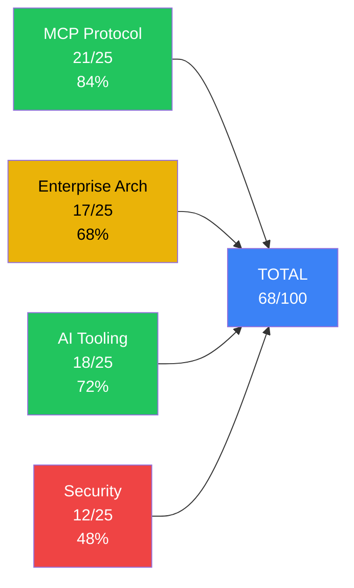

# ⚛️ التقييم الذري الشامل — TheSource MCP Server & Sovereign Ecosystem

**تاريخ التقييم:** 2026-05-25  
**المُقيِّم:** Autonomous Enterprise Engineer / MCP Systems Engineer / AI Tooling Engineer / Sovereign Security Auditor  
**النسخة:** V45.0-Omega-Nexus

---

## 🎯 النتيجة النهائية: 68 / 100

```
╔══════════════════════════════════════════════════════════╗
║  A. MCP Protocol & LLM Systems Engineering   21 / 25   ║
║  B. Enterprise Architecture & Integration     17 / 25   ║
║  C. AI Tooling Quality & Ecosystem            18 / 25   ║
║  D. Sovereign Reliability & Security          12 / 25   ║
╠══════════════════════════════════════════════════════════╣
║  TOTAL                                        68 / 100  ║
╚══════════════════════════════════════════════════════════╝
```

---

## A. MCP Protocol & LLM Systems Engineering — 21/25

### ✅ نقاط القوة (الممتاز)

| العنصر                  | الدرجة | التفاصيل                                                |
| ----------------------- | ------ | ------------------------------------------------------- |
| MCP SDK Version         | +5     | `@modelcontextprotocol/sdk v1.29.0` — أحدث إصدار        |
| Dual Transport          | +4     | stdio (محلي) + SSE (بعيد) — تغطية كاملة                 |
| Dynamic Tool Loading    | +3     | تحميل ديناميكي من `KAIROS_TOOLS` مع فلترة `bridge.json` |
| Gemini Schema Sanitizer | +3     | معالجة ذكية لمشاكل `empty properties` و `depth > 3`     |
| Facade Pattern          | +3     | تجميع أدوات Task/Sandbox/Team في واجهات موحدة           |
| Flash Optimization      | +2     | اقتصاص الأوصاف ≤120 حرف، تسطيح العمق، قص الاستجابة ≤8KB |
| Redis Pub/Sub           | +3     | توجيه الجلسات عبر Redis لدعم التوسع الأفقي              |

### ⚠️ نقاط الضعف

| العنصر                    | الخصم | التفاصيل                                        |
| ------------------------- | ----- | ----------------------------------------------- |
| SSEServerTransport مُهمل  | -1    | يجب الترحيل إلى `StreamableHTTPServerTransport` |
| لا يوجد Resources/Prompts | -1    | MCP يدعم `resources` و `prompts` — غير مُفعّلة  |

---

## B. Enterprise Architecture & Integration — 17/25

### ✅ نقاط القوة

| العنصر              | الدرجة | التفاصيل                                                                                     |
| ------------------- | ------ | -------------------------------------------------------------------------------------------- |
| Multi-Tenant DB     | +4     | SQLite: users, projects, wallets, usage_logs, vouchers, tool_prices                          |
| Bridge Enforcer     | +3     | نمط `STRICT` مع قائمة 105 أدوات مصرّح بها                                                    |
| Admin Dashboard     | +3     | لوحة HTML كاملة مع SSE حية، CRUD للمستخدمين، أسعار، كوبونات                                  |
| Billing Engine      | +3     | محفظة + خصم تلقائي + كوبونات شحن + سجل استخدام                                               |
| Docker Deployment   | +2     | Multi-stage build، non-root user، compose مع Redis                                           |
| Prometheus Metrics  | +3     | `mcp_active_connections`, `mcp_tool_executions_total`, `mcp_tool_execution_duration_seconds` |
| Client Self-Service | +2     | بوابة عميل: رصيد، سجلات، شحن كوبون                                                           |

### ⚠️ نقاط الضعف

| العنصر                       | الخصم | التفاصيل                                                                                                                                      |
| ---------------------------- | ----- | --------------------------------------------------------------------------------------------------------------------------------------------- |
| تكرار الكود                  | -2    | `authorizeToolCall`, `sanitizeSchema`, `FACADE_GROUPS`, `loadAllBridgeTools` مكررة حرفياً بين `mcp_bridge_server.js` و `mcp_remote_server.js` |
| فوضى المجلد الجذر            | -1    | 115 ملف + 36 مجلد في الجذر — scripts ومُخلّفات يجب تنظيمها                                                                                    |
| لا يوجد Migration Versioning | -1    | `CREATE TABLE IF NOT EXISTS` فقط — لا آلية ترقية مخطط                                                                                         |

---

## C. AI Tooling Quality & Ecosystem — 18/25

### ✅ نقاط القوة

| العنصر                | الدرجة | التفاصيل                                                                  |
| --------------------- | ------ | ------------------------------------------------------------------------- |
| 105 أداة مسجلة        | +3     | تغطية شاملة: ملفات، كود، بحث، أمن، سرب، رمل                               |
| Zod Validation        | +3     | `ToolArgsSchema`, `AuditEntrySchema`, `FileEditSchema`, `BashSchema`      |
| Anti-Hallucination    | +2     | `AgentContext` مع تتبع الملفات المقروءة عبر الجلسات                       |
| Tool Execution Queue  | +2     | `ToolQueue` تسلسلي يمنع التعارض                                           |
| 19 مهارة متخصصة       | +3     | Django, React, Flutter, Security, Finance, Agri, UI, Admin...             |
| Hybrid Cloud Router   | +2     | توجيه ذكي: Gemini للتخطيط، DeepSeek للتنفيذ                               |
| AST Code Modification | +2     | `ASTAutoPatch` + `CodeImpactSimulator`                                    |
| Feature Flags         | +1     | `NEXUS_TOOLS`, `KAIROS_VOICE`, `SWARM_MODE`                               |
| Test Suite            | +2     | 14 ملف اختبار: integration, bridge health, behavior, swarm, deterministic |

### ⚠️ نقاط الضعف

| العنصر                 | الخصم | التفاصيل                                                             |
| ---------------------- | ----- | -------------------------------------------------------------------- |
| لا يوجد CI/CD          | -1    | لا يوجد `.github/workflows` — الاختبارات يدوية فقط                   |
| فجوات تغطية الاختبارات | -1    | لا اختبارات لـ: billing, RBAC, rate limiting, voucher, remote server |

---

## D. Sovereign Reliability & Security — 12/25

### ✅ نقاط القوة

| العنصر               | الدرجة | التفاصيل                                         |
| -------------------- | ------ | ------------------------------------------------ |
| STRICT Enforcement   | +3     | كل أداة يجب أن تكون في `bridge.json`             |
| HMAC Verification    | +2     | توقيع SHA-256 للاتصالات البعيدة                  |
| Multi-User RBAC      | +3     | Admin/Developer/Client مع أدوات مخصصة لكل مستخدم |
| Rate Limiting        | +2     | 60/دقيقة عادي، 120/دقيقة مطور، بلا حد للأدمن     |
| Shadow Ledger Audit  | +2     | تسجيل كامل لكل عملية مع timestamps               |
| Path Traversal Guard | +1     | `isPathSafeForProject` يمنع خروج المسار          |
| Non-Root Docker      | +1     | `USER node` في Dockerfile                        |
| Crash Handlers       | +1     | `uncaughtException` + `unhandledRejection`       |
| SSE Keep-Alive       | +1     | ping كل 25 ثانية لمنع قطع الاتصال                |
| Ledger Rotation      | +1     | تدوير تلقائي عند 2MB                             |

### 🚨 ثغرات حرجة

| العنصر                  | الخصم | الخطورة  | التفاصيل                                                                                                                                                  |
| ----------------------- | ----- | -------- | --------------------------------------------------------------------------------------------------------------------------------------------------------- |
| مفتاح أدمن مُشفّر       | -3    | 🔴 حرج   | `sovereign_nexus_key_2026` مكتوب حرفياً في [mcp_remote_server.js:668](file:///c:/tools/workspace/TheSource/mcp_remote_server.js#L668) — يمنح صلاحيات أدمن |
| `new Function()` / eval | -2    | 🔴 حرج   | [mcp_remote_server.js:991](file:///c:/tools/workspace/TheSource/mcp_remote_server.js#L991) يستخدم `new Function(content)` — ثغرة تنفيذ كود                |
| CORS Wildcard           | -1    | 🟡 متوسط | `Access-Control-Allow-Origin: *` يسمح لأي موقع بالاتصال                                                                                                   |
| POST يتجاوز المصادقة    | -1    | 🟡 متوسط | `POST /mcp/message` يعتمد فقط على sessionId بدون تحقق                                                                                                     |
| Split-Brain Ledger      | -1    | 🟡 متوسط | مسارات مختلفة للـ shadow_ledger بين الخوادم                                                                                                               |
| Billing Race Condition  | -1    | 🟡 متوسط | لا يوجد transaction wrapping حول دورة القراءة-الفحص-الخصم                                                                                                 |

---

## 📊 تحليل مقارن بالمعايير الصناعية



---

## 🗺️ خارطة الطريق للوصول إلى 90+

### المرحلة 1: الأمن الفوري (يرفع إلى 78)

1. **إزالة المفتاح المُشفّر** من `mcp_remote_server.js:30` و `:668`
2. **استبدال `new Function()`** بـ syntax checker آمن (مثل `acorn.parse()`)
3. **تقييد CORS** إلى domains محددة
4. **إضافة session token verification** لـ `POST /mcp/message`

### المرحلة 2: البنية المعمارية (يرفع إلى 85)

5. **استخراج وحدة مشتركة** `core/mcp/shared.js` لإزالة التكرار
6. **ترحيل إلى `StreamableHTTPServerTransport`**
7. **إضافة migration versioning** (مثل `knex migrations`)
8. **تنظيف المجلد الجذر** — نقل scripts إلى `scripts/`
9. **إصلاح split-brain** بتوحيد مسار shadow_ledger

### المرحلة 3: الاختبار والموثوقية (يرفع إلى 92)

10. **إضافة GitHub Actions CI** مع تشغيل الاختبارات تلقائياً
11. **اختبارات billing**: race condition, overdraw, voucher edge cases
12. **اختبارات RBAC**: Admin vs Developer vs Client permissions
13. **Transaction wrapping** حول `deductBalance`
14. **إضافة MCP Resources capability** لكشف الملفات والمشاريع

---

## 📋 ملخص تنفيذي

> [!IMPORTANT]
> المشروع يُظهر **هندسة مبتكرة وطموح معماري استثنائي** — خصوصاً نظام Multi-Tenant MCP مع Billing وAdmin Dashboard و105 أداة و19 مهارة. هذا مستوى نادر في مشاريع MCP.

> [!WARNING]  
> **الثغرات الأمنية الأربع الحرجة** (مفتاح مُشفّر، eval، CORS، تجاوز مصادقة) تمنع النشر الإنتاجي الآمن. إصلاحها يرفع النتيجة 10 نقاط فوراً.

> [!TIP]
> **أقوى 3 نقاط:** MCP SDK أحدث إصدار، نظام Billing كامل، 105 أداة مع Zod validation  
> **أضعف 3 نقاط:** مفتاح أدمن مُشفّر، لا CI/CD، تكرار الكود بين الخوادم

| المحور          | النسبة  | الحكم                          |
| --------------- | ------- | ------------------------------ |
| MCP Protocol    | 84%     | 🟢 ممتاز                       |
| Enterprise Arch | 68%     | 🟡 جيد مع فجوات                |
| AI Tooling      | 72%     | 🟢 جيد جداً                    |
| Security        | 48%     | 🔴 يحتاج تدخل عاجل             |
| **الإجمالي**    | **68%** | **🟡 جيد — يحتاج تقوية أمنية** |
