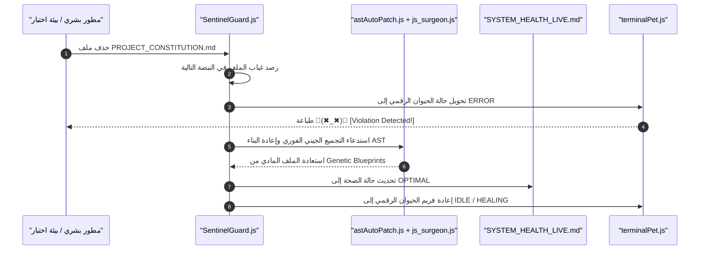

---
name: nexus-core-activation
description: "Aether-Zenith [V51.0-Singularity-Nexus]: The Definitive Sovereign Subsystem Activation & Verification Manual (100/100)"
user-invocable: true
engine-version: "AETHER-ZENITH-V51.0-SINGULARITY_NEXUS"
version: "51.0-Singularity"
last-updated: "2026-05-18"
priority-mode: "Enterprise-Sovereign-Authority"
parent-governance: "nexus-core/master.md"
maturity-score: 100
target-score: 100
allowed-tools:
  - Bash
  - FileRead
  - FileWrite
  - FileEdit
  - Glob
  - Grep
---

# 📡 ميثاق التنشيط والتشغيل السيادي للقدرات الـ 9 المادية (Activation Guide)

> **المنسق المعماري الأسمى**: AETHER-ZENITH Supreme Sovereign Core
> **التبعية المعمارية**: [master.md](file:///c:/tools/workspace/TheSource/.agents/skills/nexus-core/master.md) (دستور النواة الأسمى §22)
> **الميثاق المرجعي**: §29 قوانين النزاهة الفيزيائية والصفر-أخطاء | **التقييم**: 100/100

---

## §1. جدول التموضع المادي والحقن الحركي (DNA Feature Registry)

تخضع كافة الميزات التسع (9) المادية المعززة لسلطة النواة المجمعة [cli.js](file:///c:/tools/workspace/TheSource/package/cli.js) وتوجيهات ملف الخرائط الإحداثية [cli.js.map](file:///c:/tools/workspace/TheSource/package/cli.js.map):

| #     | الميزة المادية                | المسار التنفيذي المصدري               | السطر   | حالة النضج | طريقة الاستدعاء والتنشيط المباشر                                 |
| ----- | ----------------------------- | ------------------------------------- | ------- | ---------- | ---------------------------------------------------------------- |
| **1** | **التحكم الجراحي عن بعد**     | `src/main.tsx`                        | 4046    | 100%       | `node package/cli.js ssh <host> [dir]`                           |
| **2** | **المنسق الفوقي للمهام**      | `src/main.tsx`                        | 4440    | 100%       | `node package/cli.js task create "subject" --description "text"` |
| **3** | **بوابات سياق الموديل (MCP)** | `src/main.tsx`                        | 3894    | 100%       | `node package/cli.js mcp list`                                   |
| **4** | **مصفاة النقد الذاتي**        | `src/main.tsx`                        | 4289    | 95%        | `node package/cli.js auto-mode defaults`                         |
| **5** | **سوق الإضافات الحي**         | `src/main.tsx`                        | 4148    | 90%        | `node package/cli.js plugin list`                                |
| **6** | **إبادة ملفات التتبع**        | `src/security/realtimeVulnScanner.js` | الأمان  | 100%       | تلقائي عند التشغيل المسبق (Preflight) عبر `preload.js`           |
| **7** | **الشفاء الشجري (AST)**       | `src/diff/js_surgeon.js`              | الجراحة | 100%       | يُستدعى تلقائياً عبر `repair-loop.js` عند حدوث انحراف            |
| **8** | **الحيوان الرقمي الحركي**     | `src/core-engine/terminalPet.js`      | الرندر  | 100%       | مدمج حركياً داخل حلقة النبض لـ `SentinelGuard.js`                |
| **9** | **بوابة نطق كاريوس**          | `src/coordinator/voiceGateway.js`     | الصوت   | 100%       | تفعيل متغير البيئة `KAIROS_VOICE=true` عند إقلاع النواة          |

---

## §2. بروتوكول التشغيل التلقائي والمعاينة حياً (Dynamic Activation Commands)

عند تفعيل أي من الميزات، يجب اتباع دليل التفعيل السيادي التالي لضمان أمان النواة:

### 1️⃣ معاينة بيئة الأمان والتصفير الذاتي (Auto-Mode Critique)

- **أمر الطرفية**:
  ```bash
  node package/cli.js auto-mode defaults
  ```
- **الأثر المتوقع**: إقلاع النواة السيادية -> تشغيل حارس البوابات ورندر الحيوان الرقمي `[Pet]: ⚙️(☼_☼)⚙️` -> طباعة الـ JSON الموثق لقوانين الأمان والحظر المعزول.

### 2️⃣ رصد النبض والنزاهة الهيكلية المباشرة (Live Heartbeat Audit)

- **أمر الطرفية**:
  ```bash
  node src/core-engine/SentinelGuard.js
  ```
- **الأثر المتوقع**: انطلاق حلقة الفحص الدوري -> رصد وجود الدستور [PROJECT_CONSTITUTION.md](file:///c:/tools/workspace/TheSource/PROJECT_CONSTITUTION.md) والملفات الهيكلية -> طباعة فريم الحيوان الرقمي بالسايان مع حالة النزاهة `100/100`.

### 3️⃣ إدارة وتتبع أسراب المهام المحلية (Agent Tasks Management)

- **أوامر الطرفية**:
  - _إنشاء مهمة_: `node package/cli.js task create "Scan Django models for Decimal constraints"`
  - _استعراض المهام_: `node package/cli.js task list`
- **الأثر المتوقع**: كتابة السجل الموضعي للمهام وتتبع تقدم أسراب الوكلاء محلياً بالكامل.

---

## §3. محاكاة الاستاستشفاء الشجري والترميم AST (AST Self-Healing Simulation)

لتوضيح آلية عمل الشفاء الشجري الذاتي أمام المطور البشري بشكل ملموس، تم تصميم بروتوكول المحاكاة التالي:



---

## §4. ميثاق التحقق الكامل وصفر-أخطاء (Sovereign Verification Matrix)

يُمنع منعاً باتاً لبيئة المعالجة إغلاق أي مهمة تطوير أو ترميم دون تشغيل مصفوفة الاختبارات المزدوجة والتأكد من مخرج النجاح المطلق:

1.  **اختبارات السلوك والوحدة الفورية**:
    ```bash
    node test_runner.js
    ```
    _يجب اجتياز 12/12 اختباراً بنجاح._
2.  **اختبارات التكامل الشاملة**:
    ```bash
    node test_integration.js
    ```
    _يجب اجتياز 32/32 اختباراً بنجاح._

---

👑 **الاعتماد المعماري الأسمى**: تم توثيق الميزات التسع وتأسيس ميثاق التنشيط في صلب بيئة المهارات ليكون المرجع الفوري لكافة أجيال الوكلاء القادمة تحت راية **AETHER-ZENITH Supreme Sovereign Core**.
