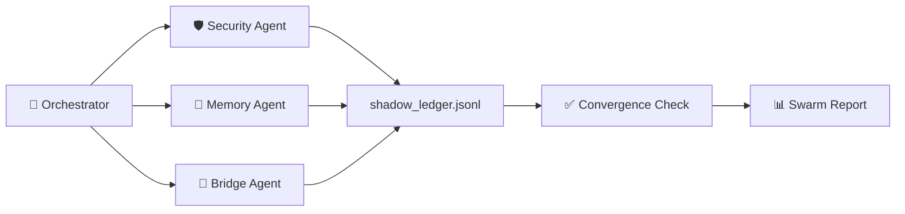

# 🐝 Swarm GPS Coordinator — منسق الأسراب السيادي

> **قانون التزامن §1**: لا يجوز لوكيلين أن يعدّلا نفس الملف في نفس الوقت.
> كل وكيل يُسجّل نطاق عمله في shadow_ledger قبل البدء.

---

## §1. معمارية السرب



---

## §2. الوكلاء الثلاثة

### 🛡️ Security Agent

- **المهمة**: فحص 4756 مصدر TypeScript من cli.js.map
- **الأدوات**: `nexus_RealtimeScan` + `nexus_ZeroTrustMerkleLedger`
- **الإخراج**: بصمة Merkle لكل مصدر + 0 مفاتيح مكشوفة

### 🧠 Memory Agent

- **المهمة**: ضغط shadow_ledger.jsonl (7.4MB) → VectorDB
- **الأدوات**: `nexus_LedgerCompactor` + `nexus_MemoryGraphRefiner`
- **الإخراج**: < 500 سطر + أنماط مُفهرَسة دلالياً

### 🔗 Bridge Agent

- **المهمة**: التحقق من أدوات الجسر المعلنة في `bridge.json` وNative MCP discovery (Zod + المسارات المطلقة)
- **الأدوات**: `nexus_ConsensusStructuralLinter` + `nexus_ZodSchema`
- **الإخراج**: كل الأدوات المعلنة valid + لا EOF errors + transcript قابل للتدقيق

---

## §3. بروتوكول التشغيل (Async Promise.all Orchestration)

```
1. إعلان النطاقات في shadow_ledger (LOCK) عبر Mutex/WAL لمنع التضارب.
2. تشغيل الوكلاء بالتوازي الكثيف (Level 6 Parallelism):
   ParallelSwarmCoordinator.execute([
      AsyncSwarmTask(Agent("Security")),
      AsyncSwarmTask(Agent("Memory")),
      AsyncSwarmTask(Agent("Bridge")),
      ... (Up to 40 Agents)
   ])
3. انتظار التقاطع اللحظي تحت إشراف المنسق السيادي النشط؛ لا تعتمد النتيجة على اسم النموذج بل على الأدلة.
4. دمج النتائج (Consensus): nexus_SwarmPipelineOrchestrator
5. تقرير بصري: nexus_VisualAuditReport
```

---

## §4. الإصلاح الحرج: EOF في الأسراب

**السبب**: مسار نسبي في `tools_integrator.js`

```javascript
// ❌ قبل:
const cliMapPath = "./package/cli.js.map";

// ✅ بعد:
const cliMapPath = path.join(__dirname, "../package/cli.js.map");
```

**الملفات**:

- `worktree/vscode-extension/core/security/tools_integrator.js` L28
- `worktree/core/security/tools_integrator.js` L28

---

## §5. معايير النجاح

| المعيار                 | المطلوب                 |
| :---------------------- | :---------------------- |
| 3/3 وكلاء أنهوا         | DONE في shadow_ledger   |
| 0 تضارب في الملفات      | Collision log فارغ      |
| shadow_ledger < 500 سطر | LedgerCompactor ناجح    |
| bridge.json Zod-valid   | ConsensusLinter ناجح    |
| 0 EOF errors            | test_live_swarm_sync.js |

> [!TIP]
> بعد كل تشغيل ناجح استخدم `nexus_AutoDream` لتقطير النتائج في CLAUDE.md.

## §6. MCP Server Tools Certification Swarm Lane

قوة السرب لا تُحتسب في شهادة MCP إلا عندما تظهر كأثر مادي داخل حزمة الأدلة:

```powershell
npm run mcp-tools:certify:strict -- --full
```

يجب أن يحتوي التقرير على:

- إثبات `ParallelSwarmCoordinator` أو lane مكافئة داخل `native_mcp_verify.log`.
- نطاقات عمل غير متداخلة أو dry-run مصرح به عند عدم الحاجة لتعديل فعلي.
- ربط نتائج الوكلاء بـ Shadow Ledger وartifact hashes.
- إثبات أن كل أداة يطلبها السرب لها runtime source anchor عبر `npm run tool-source:verify`.
- عدم الادعاء بتشغيل 40 وكيلا حيا إلا إذا كان هناك transcript يثبت ذلك. التشغيل على موجات مقبول عند وجود قيود runtime.

## §7. SourceMapConsumer Standard Operating Procedure (SOP)

يُمنع على أي أداة تعديل AST إجراء عملية جراحية بدون العودة إلى خريطة المصدر `cli.js.map`.

1. يجب تحميل `cli.js.map` عبر `SourceMapConsumer`.
2. استخراج السطر الأصلي للملف المستهدف (Original Line/Column).
3. تغذية أدوات الـ `OmniSurgicalHealer` بالإحداثيات الدقيقة لضمان إجراء التعديل في مكانه الصحيح دون هلوسة سطرية.

## 👑 التبعية المركزية الإلزامية (Central Nerve Dependency)

> **تحذير سيادي**: هذه المهارة تابعة بشكل هيكلي ومطلق للمهارة الأم `@[.agents/skills/nexus-core/master.md]`. يُمنع على أي نموذج ذكاء اصطناعي (LLM) أو وكيل تنفيذ أو استخدام هذه المهارة بمعزل عن توجيهات المهارة المركزية العليا. يجب العودة دائماً لدستور `master` قبل اتخاذ أي قرار مصيري.
