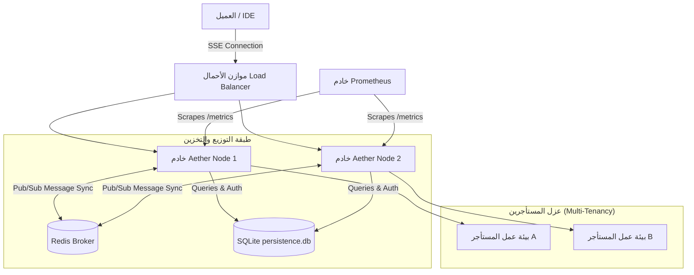
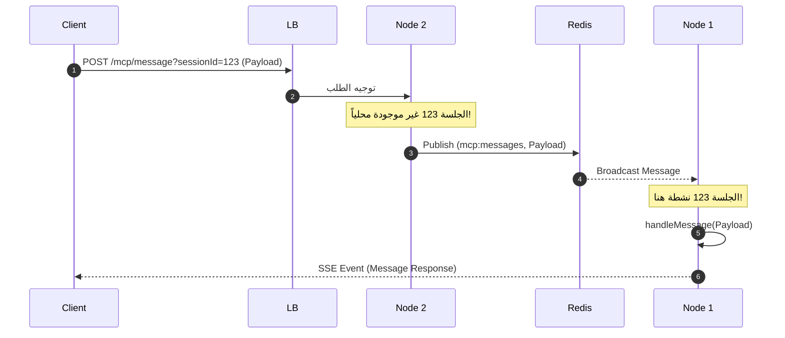

# 📖 الدليل السيادي الموحد للتشغيل والنشر (Sovereign Master Guide)
## نظام Aether-Zenith V21.1-Observability_Scale

---

## Operational Maturity Gate

The operational guide can claim 100 percent maturity only when these commands or checks are green:

- `npm test` passes the runtime and bridge test suites.
- `npm run docs:audit` returns a combined documentation maturity of 100/100.
- Admin dashboard behavior is backed by `public/admin.html` and `mcp_remote_server.js`.
- Database claims are backed by redacted schema inspection of `config/database.db`.
- Remote MCP clients can start from `.agents/skills/nexus-core/master.md` and discover the bridge, skills, dashboard, and audit workflow without external notes.

مرحباً بك في الدليل المركزي لعمليات وتشغيل منصة **TheSource (Aether Engine)**. تم تصميم هذا الدليل لتقديم إرشاد كامل بنسبة 100% لفريق العمل الإداري والتقني لتشغيل وإدارة المنصة في بيئات العمل الحية والإنتاجية السحابية متعددة المستأجرين (Multi-Tenant PaaS).

---

## 📌 فهرس المحتويات:
1. [البنية الهيكلية المعمارية (System Architecture)](#1-البنية-الهيكلية-المعمارية-system-architecture)
2. [متغيرات تكوين البيئة (Environment Configuration)](#2-متغيرات-تكوين-البيئة-environment-configuration)
3. [إدارة المستأجرين وعزل المشاريع (Multi-Tenancy & Project Boundaries)](#3-إدارة-المستأجرين-وعزل-المشاريع-multi-tenancy--project-boundaries)
4. [النشر وإعداد الحاويات (Docker & Compose Orchestration)](#4-النشر-وإعداد-الحاويات-docker--compose-orchestration)
5. [التوسع ومزامنة الجلسات (Horizontal Scaling via Redis Pub/Sub)](#5-التوسع-ومزامنة-الجلسات-horizontal-scaling-via-redis-pubsub)
6. [نظام المراقبة والتحليلات (Observability & Prometheus Metrics)](#6-نظام-المراقبة-والتحليلات-observability--prometheus-metrics)
7. [معايير الحماية والأمان السيادي (Security Hardening)](#7-معايير-الحماية-والأمان-السيادي-security-hardening)
8. [استكشاف الأخطاء وإصلاحها (Troubleshooting & Incident Response)](#8-استكشاف-الأخطاء-وإصلاحها-troubleshooting--incident-response)

---

## 🛠️ 1. البنية الهيكلية المعمارية (System Architecture)

يعتمد خادم Aether Engine على هندسة برمجية موزعة تفصل بين طبقات معالجة الطلبات، التخزين والتحقق، والبث الفوري.



---

## ⚙️ 2. متغيرات تكوين البيئة (Environment Configuration)

يتم ضبط سلوك النظام ديناميكياً عن طريق تعديل ملف التكوين `.env` في المسار الجذري للمشروع:

| المتغير البيئي | القيمة الافتراضية | الوصف الفني | الأهمية |
| :--- | :--- | :--- | :--- |
| `PORT` | `3847` | المنفذ الفيزيائي الذي يستمع إليه خادم الويب الخاص بالتطبيق. | أساسي |
| `MCP_API_KEY` | `${MCP_API_KEY}` | مفتاح التحقق الرئيسي للمسؤول (Admin) للوصول للمقاييس وحسابات المستخدمين. | حرج جداً |
| `REDIS_URL` | لا يوجد (Single-Instance) | رابط الاتصال بخادم Redis (مثال: `redis://redis:6379`). | مطلوب للتوسع |
| `DB_PATH` | `core/db/persistence.db` | المسار النسبي أو المطلق لحفظ قاعدة بيانات SQLite التراكمية. | أساسي |

---

## 🗄️ 3. إدارة المستأجرين وعزل المشاريع (Multi-Tenancy & Project Boundaries)

يتم تشغيل النظام كبيئة سحابية آمنة تخدم عدة مستخدمين بمستويات صلاحيات منفصلة، ويتم تخزين هذه البيانات في قاعدة بيانات SQLite مدمجة.

### 👥 أ. جداول ومستويات المستخدمين (Users Table)
تتوزع الأدوار وفق ثلاثة مستويات صلاحيات:
1. **Admin (المشرف):** يمتلك صلاحية تجاوز حدود الاستهلاك وقراءة مقاييس الخادم.
2. **Developer (المطور):** يمتلك صلاحية تشغيل حتى `120` طلب استدعاء في الدقيقة.
3. **Guest (الزائر):** يمتلك صلاحية تشغيل حتى `60` طلب استدعاء في الدقيقة.

**هيكل جدول المستخدمين:**
```sql
CREATE TABLE users (
  id TEXT PRIMARY KEY,
  username TEXT UNIQUE NOT NULL,
  apikey TEXT UNIQUE NOT NULL,
  role TEXT NOT NULL
);
```

### 📁 ب. حدود وعزل المشاريع (Projects Isolation)
لكل مستأجر مساحة عمل معزولة ومحددة المسار على القرص لمنع تجاوز المجلدات المصرح بها (Path Traversal).

**هيكل جدول المشاريع:**
```sql
CREATE TABLE projects (
  id TEXT PRIMARY KEY,
  name TEXT NOT NULL,
  path TEXT NOT NULL,
  owner_id TEXT NOT NULL,
  allowed_tools TEXT, -- قائمة الأدوات المسموحة بصيغة JSON Array
  enforcement_mode TEXT DEFAULT 'STRICT', -- وضع الحظر STRICT أو LAX
  FOREIGN KEY(owner_id) REFERENCES users(id)
);
```

---

## 🐳 4. النشر وإعداد الحاويات (Docker & Compose Orchestration)

لتشغيل المنصة في وضع الإنتاج المستقر، يتم بناء الحاوية مع تجريد الصلاحيات الإدارية لتقليص مساحة الهجوم الأمني.

### أ. ملف التكوين (Dockerfile):
```dockerfile
# Stage 1: تثبيت التبعيات وبناء النظام
FROM node:18-alpine AS builder
WORKDIR /app
COPY package*.json ./
RUN npm ci --only=production

# Stage 2: تشغيل المنصة بأقل صلاحيات ممكنة
FROM node:18-alpine
WORKDIR /app
ENV NODE_ENV=production
COPY --from=builder /app/node_modules ./node_modules
COPY . .
# استخدام حساب غير جذر (node) للأمان الفائق
USER node
EXPOSE 3847
CMD ["node", "mcp_remote_server.js"]
```

### ب. تشغيل النظام بلمسة واحدة:
يمكن بدء تشغيل خادم التطبيق مع قاعدة البيانات الملحقة وخدمة الكاش والاتصالات (Redis) باستخدام الأمر التالي:
```bash
docker-compose up -d --build
```

---

## 🔄 5. التوسع ومزامنة الجلسات (Horizontal Scaling via Redis Pub/Sub)

عند تشغيل مثيلات متعددة من الخادم خلف موازن أحمال (Load Balancer)، قد يحدث تشتت للاتصالات: يتصل العميل بـ SSE على خادم (أ)، ويرسل طلبات الـ Post على خادم (ب).

لتفادي هذا التعارض، يتم توجيه الرسائل تلقائياً عبر Redis:



> [!NOTE]
> إذا كان متغير `REDIS_URL` غير معرف في البيئة، سيعمل الخادم تلقائياً وبسلاسة في الوضع الأحادي (Single-Instance Mode) دون التسبب في أي أعطال روتينية.

---

## 📊 6. نظام المراقبة والتحليلات (Observability & Prometheus Metrics)

يصدر الخادم مقاييس Prometheus التراكمية في الوقت الفعلي عبر مسار آمن لا يمكن تصفحه إلا من خلال مفاتيح الـ Admin.

### 📈 مقاييس الأداء المتاحة:
- `mcp_active_connections`: عدد اتصالات الـ SSE المفتوحة في الوقت الحالي لكل عميل ومشروع.
- `mcp_tool_executions_total`: عداد يحصي الاستدعاءات الناجحة والفاشلة لكل أداة على حدة.
- `mcp_tool_execution_duration_seconds`: يقيس توزيع الفترات الزمنية لتنفيذ العمليات.

**طلب الفحص البرمجي يدوياً:**
```bash
curl "http://localhost:3847/metrics?apikey=${MCP_API_KEY}"
```

---

## 🛡️ 7. معايير الحماية والأمان السيادي (Security Hardening)

* **منع Path Traversal:** يقوم النظام بالتحقق أوتوماتيكياً من أن جميع طلبات الملفات تقع تحت مسار المشروع المسجل في قاعدة البيانات لضمان عدم وصول المطور إلى ملفات النظام الحساسة مثل `.env`.
* **محدد الطلبات (Rate Limiting Middleware):** يحمي الخادم من هجمات الإغراق (DoS) وعمليات الاستدعاء اللانهائية، ويعمل على تقييد الطلبات تلقائياً بالاعتماد على هوية العميل وعنوان الـ IP.

---

## 🩹 8. استكشاف الأخطاء وإصلاحها (Troubleshooting & Incident Response)

| المشكلة | السبب المحتمل | خطة العلاج السريع |
| :--- | :--- | :--- |
| **فشل بدء اتصال Redis** | عنوان `REDIS_URL` غير صحيح أو خادم Redis متوقف. | تحقق من حالة الحاوية باستخدام `docker logs redis`. الخادم سيعمل تلقائياً في وضع Fallback. |
| **رفض الطلبات برمز 429** | استهلاك المطور لكامل الحصص المخصصة في الدقيقة. | قم بترقية حساب العميل في جدول `users` إلى دور `Developer` أو `Admin` لتجاوز الحدود. |
| **الخادم لا يستجيب لرسائل الـ MCP** | تفعيل Express parser عالمياً واستهلاك الـ stream قبل الـ SDK. | تأكد من عدم تعريف `app.use(express.json())` عالمياً على مستوى الخادم. |
