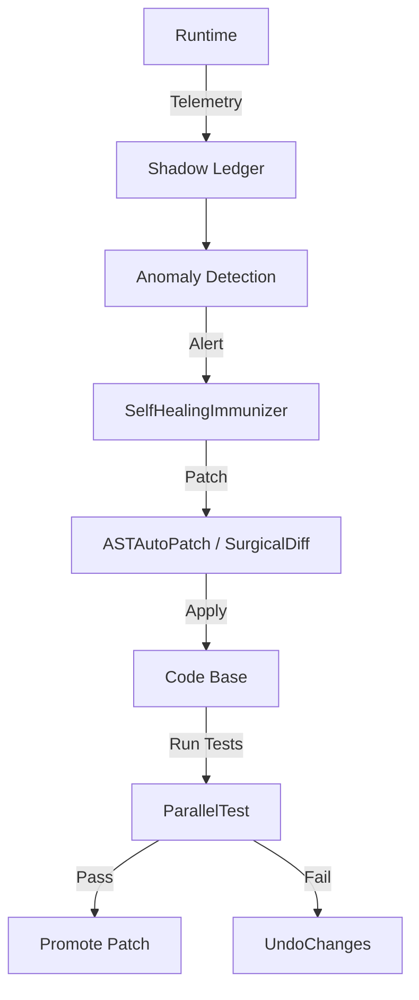

# Self‑Healing Loop Documentation

## Overview
The **Self‑Healing Loop** is an automated process that continuously monitors the application at runtime, detects failures, and applies corrective patches without human intervention. It consists of four main stages:

1. **Telemetry Collection** – Runtime metrics, error stack traces, and performance data are streamed to the **Shadow Ledger** and a dedicated monitoring service.
2. **Failure Detection** – Anomaly detection models (e.g., statistical thresholds, ML classifiers) analyze the telemetry in real‑time and raise alerts when a deviation is observed.
3. **Root‑Cause Analysis** – The **SelfHealingImmunizer** tool parses the error stack, performs a semantic lookup of the offending symbol, and generates a minimal patch using **ASTAutoPatch** or **SurgicalDiff**.
4. **Automated Repair** – The generated patch is applied, the change is recorded in the **Shadow Ledger**, and a regression test suite is executed via **ParallelTest** to verify stability. If the test passes, the patch is promoted to the main branch; otherwise, the change is rolled back using **UndoChanges**.

---

## Architecture Diagram


---

## Step‑by‑Step Procedure

1. **Enable Monitoring**
   ```bash
   # Start the telemetry collector (runs in background)
   npm run start:telemetry
   ```
   The collector writes JSON lines to `shadow_ledger.jsonl`.

2. **Configure Detection Rules**
   Edit `config/self_healing_rules.json` to define thresholds (e.g., CPU > 80 % for >30 s, uncaught exceptions, `process.exit` calls).

3. **Automatic Patch Generation**
   When an alert fires, the system executes:
   ```json
   {
     "tool": "SelfHealingImmunizer",
     "args": {
       "error_stack": "<captured stack trace>",
       "target_file": "src/<module>.js"
     }
   }
   ```
   The tool returns a diff that is then applied with `ASTAutoPatch`.

4. **Verification**
   ```json
   {
     "tool": "ParallelTest",
     "args": { "target_file": "src/" }
   }
   ```
   If the test suite succeeds, the patch is committed; otherwise, the system calls:
   ```json
   {
     "tool": "UndoChanges",
     "args": { "file_path": "src/<module>.js" }
   }
   ```

5. **Audit Trail**
   Every action (detection, patch generation, test result, commit/rollback) is automatically logged to `shadow_ledger.jsonl` with timestamps, tool name, and arguments, ensuring full forensic traceability.

---

## Best Practices
- **Keep the test suite comprehensive** – Include unit, integration, and performance tests for critical paths.
- **Version the rules** – Store `self_healing_rules.json` in Git; changes trigger a re‑run of the detection engine.
- **Review generated patches** – Enable a manual review gate for high‑severity patches by configuring `SelfHealingImmunizer` with `approval_required: true`.
- **Limit patch scope** – The immunizer should only modify the offending function or line to avoid unintended side effects.
- **Run periodic audits** – Use `ShadowLedgerAudit` and `VisualAuditReport` to verify that all self‑healing actions are correctly recorded.

---

## Integration Example
```js
// src/selfHealingCoordinator.js
import { SelfHealingImmunizer } from 'nexus-tools';
import { ParallelTest } from 'nexus-tools';
import { UndoChanges } from 'nexus-tools';

export async function handleError(error) {
  const patch = await SelfHealingImmunizer({
    error_stack: error.stack,
    target_file: error.filePath,
  });

  // Apply the patch (ASTAutoPatch internally)
  // ...

  const testResult = await ParallelTest({ target_file: 'src/' });
  if (!testResult.success) {
    await UndoChanges({ file_path: error.filePath });
  }
}
```

---

## References
- `SelfHealingImmunizer` – https://github.com/your-org/nexus-tools#selfhealingimmunizer
- `ASTAutoPatch` – https://github.com/your-org/nexus-tools#astautopatch
- `ParallelTest` – https://github.com/your-org/nexus-tools#parallelt
- `ShadowLedgerAudit` – https://github.com/your-org/nexus-tools#shadowledgeraudit

---

*Document version:* 1.0 – Created on 2026‑06‑17
*Author:* Sovereign Ops Team


---
> **🛡️ CERTIFIED BY THESOURCE (V17.0 OMEGA)**
> Sovereign Swarm Remote Execution Node
> **Timestamp:** `2026-06-18T08:51:28.180Z`
> **Cryptographic IQ Hash:** `d49bc03c6ad59fb3...`
<!-- SOV_HASH:d49bc03c6ad59fb34c7b5d0140389b0d8d553e0795c53d2c6040f8cb44571b5d -->
