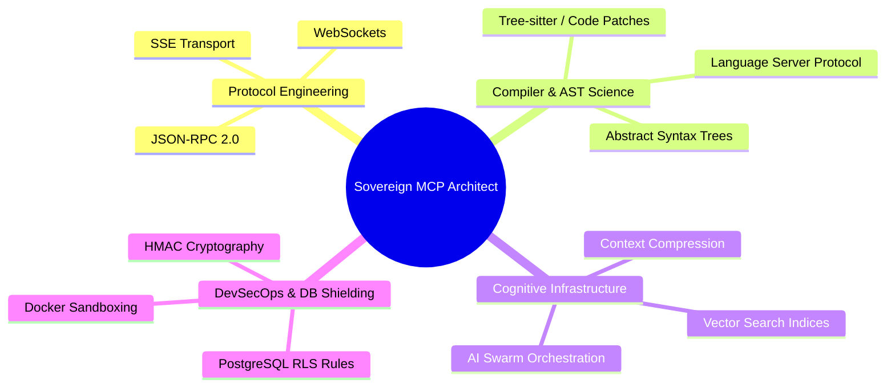

# 🏛️ Elite Job Profile: Sovereign MCP Architect & Cognitive Infrastructure Engineer

> **Document Ref:** SOV-HR-MCP-ARCHITECT-V1.0  
> **Classification:** **STRICT Mode / Enterprise Governance**  
> **Position Status:** **CRITICAL CORE ROLE**

---

## 1. Job Title & Vision

### 💼 Job Title:

**Sovereign MCP Architect & Cognitive Infrastructure Engineer**  
_(معماري بروتوكول MCP ومعندس البنية التحتية المعرفية السيادية)_

### 🎯 Mission:

The Sovereign MCP Architect is responsible for building, securing, and scaling the critical middleware layer that connects Large Language Models (LLMs) with enterprise GRP systems. This professional does not write standard CRUD applications; instead, they build the **cognitive nervous system** and **sensory toolkits** that allow AI agents to interact with production databases, compilers, and file systems with absolute safety and deterministic accuracy.

---

## 2. Core Specializations (التخصص البرمجي والفكري)

This position requires a rare, high-level specialization intersecting four distinct software domains:

---

## 3. Key Responsibilities & Deliverables

1. **Cognitive Pipeline Architecture:**
   - Design and implement secure, low-latency **Server-Sent Events (SSE)** and Standard Input/Output JSON-RPC transport layers to expose system capabilities to LLM clients.
   - Build background indexing engines that compile semantic code definitions into light-weight, highly dense context models.
2. **Deterministic Code Manipulation Tools:**
   - Integrate language servers (Dart, Pyright, tsserver) using the **Language Server Protocol (LSP)**.
   - Write custom AST (Abstract Syntax Tree) patchers that modify codebase elements at precise line and token coordinates, guaranteeing 0% syntax errors.

3. **DevSecOps & Cognitive Guardrails:**
   - Enforce cryptographic security on all incoming tool invocation payloads using **HMAC SHA-256 signatures**.
   - Build sandboxed containers that execute automated test suites (Django migrations check and GRP UAT loops) on every proposed change before code compilation is allowed.

---

## 4. Technical Skill Set Matrix

| Skill Area                | Required Technologies / Tools                                                         | Expertise Level |
| :------------------------ | :------------------------------------------------------------------------------------ | :-------------: |
| **Backend & Middlewares** | Python (Django, FastAPI), Node.js (Express, SSE SDK), Go or Rust (high-speed parsers) |   **Expert**    |
| **Protocols & RPC**       | JSON-RPC 2.0, SSE, WebSockets, REST APIs                                              |   **Expert**    |
| **AST & Compilers**       | Babel, Esprima, Python `ast` module, Tree-sitter, LSP clients                         |  **Advanced**   |
| **Database & Security**   | PostgreSQL (Row-Level Security), SQLite (WAL mode), HMAC, OAuth                       |  **Advanced**   |
| **Orchestration**         | Docker, Git, bash/PowerShell automation, CI/CD runners                                |  **Advanced**   |

---

## 5. Security & Operating Rules for the Role

Any architect in this position must strictly adhere to the following **Sovereign Operating Rules**:

- **Rule 1: Absolute Local Isolation (قاعدة العزل المحلي التام):**
  No codebase telemetry, database rows, or financial ledger data may be sent outside the secure, local enterprise firewall. All indexing and semantic compression must happen _on-premises_.
- **Rule 2: Idempotent Execution Gate (قاعدة التكرار والتحقق):**
  Every tool written for the MCP server must support deterministic execution. Double mutations or out-of-order execution must be blocked using unique request tokens.
- **Rule 3: Compiler-Enforced Promotion (قاعدة الترقية البرمجية المشروطة):**
  No tool may allow the AI agent to write directly to production without passing through the AST Code Impact Simulator and background sandboxed container verification loops.

---

## 6. Key Performance Indicators (KPIs) & Success Metrics

Any architect executing in this capacity will be held to the following operational standard:

1. **Precision of Code Changes (AST Safety):** Target a **0% syntax-error rate** on automated code manipulation tasks executed via the bridge.
2. **Tool Response Latency:** Design lightweight JSON-RPC / SSE endpoints keeping average execution time **under 100ms** locally.
3. **Guardrail Enforcements:** Achieve **100% Zod validation coverage** across all exposed tool schemas, with zero permissive or untyped parameter bypasses.
4. **SLA and Reliability Target:** Maintain system availability above **99.9%** for continuous background indexing routines.

---

## 7. Candidate Practical Evaluation Task

To qualify for this elite engineering role, candidates must complete the following practical sandbox challenge:

- **Task Scope:** Develop a lightweight, fully functional **Model Context Protocol (MCP) server** using Node.js or Python.
- **Requirements:**
  1. Integrate a local **Tree-sitter parser** to extract structural elements (functions, variables) from a targeted file.
  2. Implement an **AST rewrite endpoint** that modifies a targeted function's body safely at exact coordinate coordinates.
  3. Enforce **HMAC-SHA256 signature verification** on all incoming tool payloads using a shared secret token.
  4. Pass all inputs through a strict **Zod validation schema** before passing variables to the execution harness.
- **Success Criteria:** Verification suite executing the MCP server inside a sandboxed Docker container achieves a 0% crash rate and catches 100% of tampered/unsigned request payloads.
