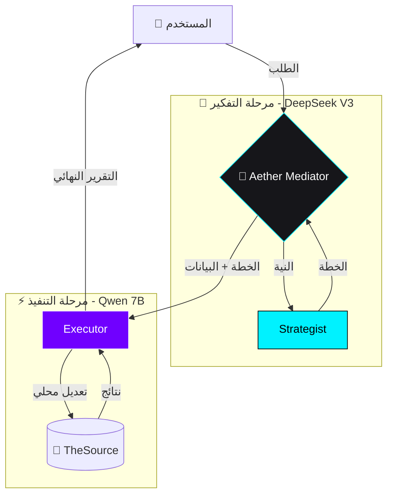

# ⚡ بروتوكول مود 0-توكن (Zero-Token Sovereign Protocol)

> **الحالة**: 🟢 ACTIVE (SUPRA-ZENITH) | **الإصدار**: V1.9 | **المعماري**: Aether-Nexus Master

---

## 💎 النظرة الاستراتيجية

تعتمد هذه المعمارية على مبدأ **"الانقسام الإدراكي" (Cognitive Split)** لتحقيق أقصى درجات الكفاءة التشغيلية مع تقليل استهلاك التوكنات المدفوعة بنسبة تصل إلى **90%**.

> [!IMPORTANT]
> **التنسيق السيادي**
> يتم استخدام **deepseek-ai/DeepSeek-V3** كـ "رأس" مفكر (Head) لوضع الخطة، بينما يقوم **Qwen-7B** بدور "الجسد" المنفذ (Body) الذي يتعامل مع البيانات الضخمة مجاناً.

---

## 📊 ١. المخطط المعماري (Architectural Matrix)

---

## 🛠️ ٢. مصفوفة توزيع الأدوار

| المحرك (Engine)             | القوة السيادية      | المهمة الرئيسية                      | التكلفة     |
| :-------------------------- | :------------------ | :----------------------------------- | :---------- |
| **deepseek-ai/DeepSeek-V3** | 🧠 الاستدلال العميق | التخطيط الاستراتيجي وفك الغموض       | مدفوع (ذكي) |
| **Qwen-7B (Free)**          | ⚡ السرعة والتكامل  | تنفيذ الأدوات ومعالجة البيانات الخام | **0 توكن**  |

---

## 🚀 ٣. تحسينات Zenith V1.9 المحقونة

> [!TIP]
> **اكتشاف المهارات الذكي (@Discovery)**
> بلمسة زر واحدة، يمكنك استدعاء أي خبير من مجلد المهارات السيادية وتطبيقه على مشروعك.

### 🌟 المزايا الجمالية والتقنية:

- **Glassmorphism Console**: واجهة تعامل شفافة ومريحة للعين.
- **Arabic Bidi-Shaping**: إصلاح شامل لعرض الحروف العربية المتصلة.
- **Intelligent Buffer**: دعم لصق البرومبتات العملاقة دون الحاجة لشرطات مائلة.

---

## 🛡️ ٤. بروتوكول التحقق الجنائي (Forensic Audit)

لا يتم اعتماد أي تعديل إلا بعد اجتياز:

1.  **Atomic Check**: فحص سلامة الوظائف الفردية.
2.  **Truth Flow**: التأكد من أن البيانات تمر بسلاسة من القاعدة للواجهة.
3.  **Security Sweep**: التأكد من عدم وجود مفاتيح مسربة (`sk-`).

---

_Nexus-Engine V1.9 — Sovereign Arabic Intelligence. Zenith Edition._
