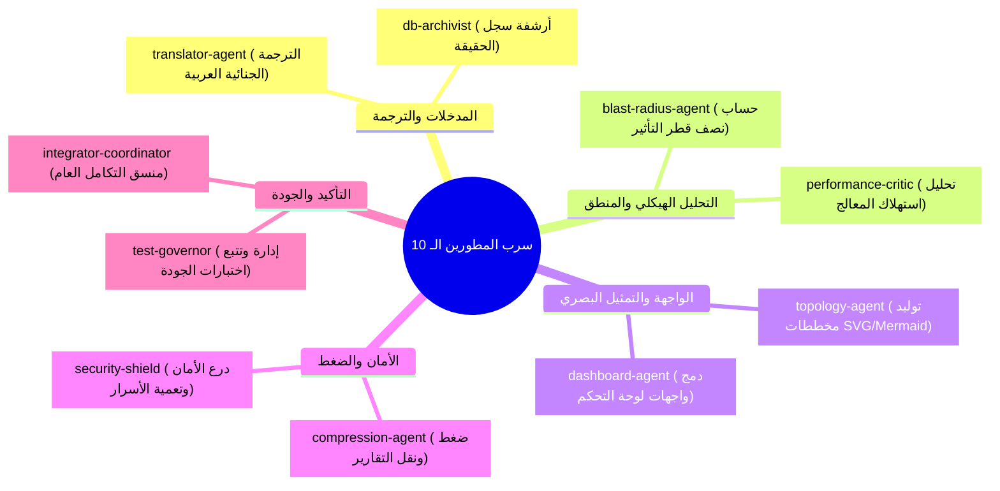

# 🗺️ خارطة الطريق المعمارية: نظام التقارير والتشخيص الذري المطور (SRE v2.0)

> **المُعد بواسطة**: كبير مهندسي النظم السيادية (`AETHER-ZENITH`)
> **تاريخ الإصدار**: يونيو 2026
> **حالة المخطط**: معتمد وجاهز للتفويض والتنفيذ بواسطة سرب الوكلاء المتخصصين الـ 10.

يضع هذا المستند خارطة طريق تفصيلية لتطوير وترقية نظام التقارير والتشخيص الذري داخل منصة **TheSource**، وتوزيع المهام بدقة على 10 وكلاء متخصصين لضمان تنفيذ متوازي عالي الجودة بنسبة **100/100**.

---

## 📐 1. الأهداف الرئيسية للنظام المطور (SRE v2.0 Objectives)

* **الشفافية الكاملة (Absolute Traceability)**: ربط كل تعديل برمجي بالتأثير البنيوي على شجرة الإعراب المجردة (AST).
* **اللغة العربية الافتراضية (Native Arabic Diagnostics)**: تحويل الأخطاء البرمجية الصعبة واستثناءات البناء إلى ملخصات تشخيصية عربية واضحة ومبسطة.
* **المخططات الحركية (Interactive Visualizations)**: استخدام مخططات Mermaid و SVG تفاعلية تعكس تدفق العمليات وحالة سلامة المنظومة حياً.
* **كفاءة الموارد في البيئات الضعيفة (Low-Bandwidth Optimization)**: ضغط التقارير المشفرة لتسهيل نقلها لحظياً بأقل استهلاك ممكن للبيانات.

---

## 👥 2. تفويض المهام وتوزيع الأدوار على الوكلاء الـ 10 (Sovereign Swarm Delegation)

تم تقسيم العمل إلى 10 قطاعات مستقلة ومتكاملة، وتم إسناد كل قطاع إلى وكيل ذكي متخصص:

### 1️⃣ `translator-agent` (وكيل الترجمة الجنائية المبسطة)
* **المهمة**: بناء محرك ترجمة الأخطاء `arabic_error_mapper.js`.
* **طريقة العمل**: يعترض أخطاء Vitest و TypeScript و ESLint، ويقوم بخرائط ترجمة (Mapping) للأكواد الشائعة إلى لغة عربية مفهومة دون تعديل في بنية الخطأ الأصلي.
* **المخرج المستهدف**: ملف `core/diagnostics/arabic_error_mapper.js` مع قاموس مصطلحات الأخطاء.

### 2️⃣ `topology-agent` (وكيل التمثيل البصري والخرائط)
* **المهمة**: تطوير مولد المخططات التفاعلية بنسق SVG و Mermaid.
* **طريقة العمل**: يحلل مخرجات الـ SourceMap ويدمجها في رسم بياني يوضح مكان التعديل بدقة وتدفق الحزم البرمجية.
* **المخرج المستهدف**: فئة `core/diagnostics/visual_topology_generator.js`.

### 3️⃣ `blast-radius-agent` (وكيل حساب نصف قطر تأثير التعديل)
* **المهمة**: تحليل مدى خطورة التعديل الجراحي على بقية مديولات المشروع.
* **طريقة العمل**: يقرأ التغيير المطلوب في الأكواد ويقارنه بشجرة العلاقات البرمجية ويخرج نسبة مئوية للمخاطرة (Risk Blast-Radius Score).
* **المخرج المستهدف**: أداة `PrecognitionAstMutator` المحدثة لحساب حجم المخاطر.

### 4️⃣ `compression-agent` (وكيل ضغط التقييمات للشبكات الضعيفة)
* **المهمة**: ضغط التقارير وتشفيرها لسهولة النقل.
* **طريقة العمل**: يقوم بترميز (Serialization) مخرجات التقارير الكبيرة وضغطها باستخدام خوارزميات خفيفة في Node.js، لبثها بأقل حجم (أقل من 2KB).
* **المخرج المستهدف**: فئة `core/diagnostics/telemetry_compressor.js`.

### 5️⃣ `dashboard-agent` (وكيل دمج واجهات لوحة التحكم السيادية)
* **المهمة**: تحديث لوحة التحكم تفاعلياً لعرض التقارير والمخططات.
* **طريقة العمل**: تعديل صفحة `dashboard.html` لعرض المخططات الحية الحركية وتصفية الأخطاء باللغة العربية.
* **المخرج المستهدف**: رقع برمجية لصفحات `public/admin.html` و `core/dashboard/dashboard.html`.

### 6️⃣ `test-governor` (وكيل حوكمة وتتبع اختبارات الجودة)
* **المهمة**: التأكد من أن التعديلات التشخيصية لا تؤثر على استقرار الاختبارات الأساسية.
* **طريقة العمل**: تشغيل أداة `test_runner.js` تلقائياً ومراقبة مؤشرات الأداء (SLO) والتأكد من تغطية الاختبارات لمديولات التشخيص الجديدة.
* **المخرج المستهدف**: تقرير فحص الاختبارات التلقائي `tests/test-results/diagnostic_coverage.json`.

### 7️⃣ `security-shield` (وكيل تدقيق أمان التقارير والأسرار)
* **المهمة**: حجب كافة البيانات الحساسة (الرموز السرية ومفاتيح الـ API) من الظهور في التقارير.
* **طريقة العمل**: مسح التقارير المتولدة قبل حفظها واستبدال المفاتيح بـ `[REDACTED_SECRET]` لضمان عدم تسريب أي رمز سري.
* **المخرج المستهدف**: فلتر الأمان المدمج `core/diagnostics/security_redactor.js`.

### 8️⃣ `db-archivist` (وكيل أرشفة وحوكمة سجل الحقيقة)
* **المهمة**: ربط مخرجات التشخيص بسجل الظل `shadow_ledger.jsonl`.
* **طريقة العمل**: كتابة بصمة رقمية مشفرة وموقعة لكل تقرير تشخيصي متولد داخل قاعدة البيانات وسجل الظل لضمان سلامة الأدلة.
* **المخرج المستهدف**: مديول التكامل `core/db/diagnostics_archivist.js`.

### 9️⃣ `performance-critic` (وكيل نقد ومراقبة الأداء)
* **المهمة**: التأكد من أن عملية توليد التقارير والترجمة والتمثيل البصري لا تستهلك معالج الخادم ولا تبطئ زمن الاستجابة.
* **طريقة العمل**: مراقبة زمن تنفيذ عمليات SRE v2.0 وتحديد وحل أي اختناق برمي (Performance Bottlenecks).
* **المخرج المستهدف**: تقارير Latency وضبط استهلاك الذاكرة في ملفات التهيئة.

### 🔟 `integrator-coordinator` (المنسق العام للتكامل والدمج)
* **المهمة**: إدارة تزامن الوكلاء التسعة الآخرين وجمع مخرجاتهم في رزمة واحدة موحدة.
* **طريقة العمل**: التنسيق المتوازي وحل أي نزاع برمجي وتصدير التقييم النهائي المطابق لمعيار **CERTIFIED_100**.
* **المخرج المستهدف**: تشغيل وإتمام بوابة الاعتماد المتكاملة `npm run mcp-tools:certify:strict`.

---

## 📅 3. مراحل وجدول التنفيذ (Implementation Phases)

### 🏁 المرحلة الأولى: التأسيس والبنية التحتية (أسبوع 1)
* [ ] يقوم `translator-agent` و `security-shield` ببناء النواة الأساسية لفلترة وترجمة الأخطاء.
* [ ] يقوم `blast-radius-agent` و `db-archivist` بتهيئة قواعد البيانات وسجل الظل لاستيعاب البيانات الجديدة.

### 🎨 المرحلة الثانية: التمثيل البصري والواجهات (أسبوع 2)
* [ ] يقوم `topology-agent` و `dashboard-agent` برسم الواجهات وربط المخططات الحركية باللوحة.
* [ ] يقوم `compression-agent` بتهيئة خوارزميات الضغط لنقل البيانات التفاعلية.

### 🏆 المرحلة الثالثة: التدقيق والتأصيل (أسبوع 3)
* [ ] يقوم `test-governor` و `performance-critic` بإجراء الاختبارات الشاملة وقياس الأداء تحت الضغط.
* [ ] يقود `integrator-coordinator` المزامنة النهائية وحقن النظام بالكامل في دورة التطوير المستمر (CI/CD) للحصول على شهادة الجاهزية 100/100 المطلقة.
