# 🚀 دليل النشر والتهيئة السيادي (Sovereign Deployment Guide)
## نظام Aether-Zenith V21.1-Observability_Scale

يغطي هذا الدليل تفاصيل نشر وتشغيل وإعداد منصة **TheSource (Aether Engine)** في بيئات الاختبار والإنتاج السحابي باستخدام الحاويات (Docker) وإدارة قواعد البيانات المدمجة.

---

## 📋 1. متطلبات النظام الأساسية (System Prerequisites)

قبل البدء في عملية النشر، تأكد من توفر الأدوات التالية على الخادم المستهدف:

- **نظام التشغيل:** Linux (Ubuntu 22.04 LTS أو أحدث) أو Windows Server.
- **Docker Engine:** إصدار `24.0.0` أو أحدث.
- **Docker Compose:** إصدار `2.20.0` أو أحدث.
- **مساحة التخزين:** مساحة كافية لتخزين سجلات الجلسات (Shadow Ledger) وقاعدة بيانات SQLite.

---

## 🐳 2. معمارية الحاويات والنشر (Docker Orchestration)

يعتمد النشر في بيئة الإنتاج على فصل الخدمات وعزل المكونات عبر حاويات مستقلة كما يلي:

```mermaid
graph LR
    User([المطور/العميل]) -->|Port 3847| Proxy[مخفف الأحمال / Proxy]
    Proxy --> Server[Aether Server Container]
    Server -->|Port 6379| Redis[Redis Cache & Pub/Sub Container]
    Server -->|File Mount| Volume[(SQLite DB & Shadow Ledger)]
```



### أ. ملف تكوين الحاوية ([Dockerfile](file:///C:/tools/workspace/TheSource/Dockerfile))
يتم بناء خادم الـ Node.js باستخدام Alpine Linux لتقليل حجم الحاوية وسد الثغرات الأمنية، مع سحب الصلاحيات الإدارية وتشغيل التطبيق بحساب مستخدم عادي `node`:

```dockerfile
# Stage 1: Build dependencies
FROM node:18-alpine AS builder
WORKDIR /app
COPY package*.json ./
RUN npm ci --only=production

# Stage 2: Production release
FROM node:18-alpine
WORKDIR /app
ENV NODE_ENV=production
COPY --from=builder /app/node_modules ./node_modules
COPY . .
USER node
EXPOSE 3847
CMD ["node", "mcp_remote_server.js"]
```

### ب. تكوين شبكة الخدمات ([docker-compose.yml](file:///C:/tools/workspace/TheSource/docker-compose.yml))
يربط ملف Docker Compose خادم التطبيق مع حاوية Redis ومجلدات تخزين البيانات المشتركة:

```yaml
version: '3.8'

services:
  mcp-server:
    build: .
    ports:
      - "3847:3847"
    environment:
      - PORT=3847
      - MCP_API_KEY=${MCP_API_KEY}
      - REDIS_URL=redis://redis:6379
      - DB_PATH=/app/data/persistence.db
    volumes:
      - mcp-data:/app/data
    depends_on:
      - redis
    restart: always

  redis:
    image: redis:7-alpine
    ports:
      - "6379:6379"
    restart: always

volumes:
  mcp-data:
```

---

## 🏁 3. خطوات التشغيل السريع (Quick Start)

نفذ الخطوات التالية لبدء تشغيل النظام بالكامل في دقيقة واحدة:

```bash
# 1. انتقل إلى مجلد المشروع الجذري
cd /tools/workspace/TheSource

# 2. قم ببناء حاويات النظام وتشغيلها في الخلفية
docker-compose up -d --build

# 3. تحقق من حالة الحاويات النشطة
docker-compose ps
```

---

## 🗃️ 4. إدارة تحديث وقاعدة البيانات (DB Migrations & Integrity)

يحتوي الخادم على نظام مهاجرة تلقائي (Auto-Migration) مدمج في ملف [db_manager.js](file:///C:/tools/workspace/TheSource/core/db/db_manager.js).

### 🔄 كيف تعمل التحديثات التلقائية عند التشغيل:
1. عند بدء تشغيل الحاوية، يتحقق `db_manager.js` من وجود ملف قاعدة البيانات `persistence.db`.
2. في حال عدم وجوده، ينشئ جداول `users` و `projects` تلقائياً.
3. يقوم النظام بقراءة ملفات الإعدادات القديمة (`users.json` و `projects.json`) ويقوم بتغذية البيانات (Seeding) تلقائياً لضمان عدم فقدان أي مستخدم سابق.

### 🔍 فحص سلامة البيانات يدوياً:
يمكنك الدخول داخل الحاوية واستخدام موجه أوامر SQLite للتحقق من سلامة الجداول:

```bash
# الدخول إلى الحاوية
docker-compose exec mcp-server sh

# تشغيل SQLite3 لفحص البيانات
sqlite3 /app/data/persistence.db "SELECT * FROM users;"
```

---

## 🩺 5. اختبارات التحقق من جاهزية الإنتاج (Production Health-Checks)

قبل الإعلان عن جاهزية الخادم لاستقبال الطلبات الفعلية، يجب فحص جميع مسارات العمل الحيوية:

```bash
# 1. فحص سلامة النظام وتأكيد الاتصال
curl -i "http://localhost:3847/health?apikey=${MCP_API_KEY}"

# الاستجابة المتوقعة:
# HTTP/1.1 200 OK
# {"status":"OK","version":"21.1","activeSessions":0}
```

```bash
# 2. اختبار كفاءة الـ Rate Limiter بمحاولة طلبات متتالية سريعة
for i in {1..10}; do curl -s "http://localhost:3847/health?apikey=some_guest_key"; done
```

---

## 🛡️ 6. الممارسات الفضلى للأمان الفائق (Production Best Practices)

> [!NOTE]
> يوصى بشدة باتباع الإرشادات التالية لحماية الخادم في بيئات التشغيل الحية:

- **تشفير حركة البيانات (TLS/SSL):** لا تعرض منفذ `3847` للإنترنت العام مباشرة؛ ضع خادم Nginx أو Traefik كـ Reverse Proxy لتوفير التشفير الآمن وحماية النقل.
- **حظر المنافذ الداخلية لـ Redis:** تأكد من أن منفذ Redis `6379` مغلق خارج شبكة Docker الداخلية لضمان عدم استغلاله من الخارج.
- **تحديث مفاتيح الـ API دورياً:** ينصح بتغيير مفاتيح المطورين والمسؤولين كل 90 يوماً وتحديثها مباشرة في قاعدة البيانات.
