# 🤖 كتالوج التشغيل السيادي (Sovereign Ops Manual)
## نظام Aether-Zenith V21.1-Observability_Scale

مرحباً بك في دليل الإدارة والتشغيل السيادي لمنصة **TheSource (Aether Engine)**. يهدف هذا الكتالوج لمساعدة مهندسي العمليات والمطورين في إدارة وتوسيع ومراقبة بيئة العمل السحابية متعددة المستأجرين (Multi-Tenant PaaS) بكفاءة وأمان كامل.

---

## 📐 1. الهيكل العام للنظام (System Architecture)

تعتمد المنصة على بنية تحتية سحابية معزولة توفر خدمات بروتوكول سياق النموذج (MCP) لكل مستأجر بموثوقية عالية.

```mermaid
graph TD
    Client[عميل الذكاء الاصطناعي / IDE] -->|SSE Connection| LB[موازن الأحمال Load Balancer]
    LB --> Node1[خادم Aether Node 1]
    LB --> Node2[خادم Aether Node 2]
    
    subgraph "طبقة التوزيع والتخزين"
        Node1 <-->|Pub/Sub Message Sync| Redis[(Redis Broker)]
        Node2 <-->|Pub/Sub Message Sync| Redis
        Node1 -->|Queries & Auth| SQLite[(SQLite persistence.db)]
        Node2 -->|Queries & Auth| SQLite
    end

    subgraph "عزل المستأجرين (Multi-Tenancy)"
        Node1 --> TenantA[بيئة عمل المستأجر A]
        Node2 --> TenantB[بيئة عمل المستأجر B]
    end
    
    Prom[خادم Prometheus] -->|Scrapes /metrics| Node1
    Prom -->|Scrapes /metrics| Node2
```



---

## ⚙️ 2. إعداد وتكوين البيئة (Environment Configuration)

يتم تكوين النظام بالكامل عبر المتغيرات البيئية في ملف `.env`. إليك المتغيرات الأساسية:

| المتغير البيئي | القيمة الافتراضية / الوصف | الأهمية |
| :--- | :--- | :--- |
| `PORT` | `3847` (المنفذ الافتراضي للخدمة) | أساسي |
| `MCP_API_KEY` | مفتاح الوصول الرئيسي للمسؤول (Admin) | حرج جداً |
| `REDIS_URL` | رابط الاتصال بـ Redis (مثال: `redis://redis:6379`) | مطلوب للتوسع الأفقي |
| `DB_PATH` | مسار قاعدة بيانات SQLite (الافتراضي: `core/db/persistence.db`) | أساسي لحفظ البيانات |

> [!WARNING]
> في بيئة الإنتاج الفعلي، يجب تغيير مفتاح `MCP_API_KEY` الافتراضي وتوليد مفتاح عشوائي مشفر وقوي جداً لمنع أي استدعاءات غير مصرح بها.

---

## 🗄️ 3. إدارة المستأجرين والمشاريع (Tenants & Projects Management)

يتم تخزين بيانات المستخدمين والمشاريع داخل قاعدة بيانات **SQLite** محلياً لضمان الاستمرارية والأداء الفائق.

### 👤 أ. إضافة مستخدم جديد (Tenant)
عند بدء تشغيل النظام لأول مرة، يقوم الخادم تلقائياً بهجرة البيانات القديمة من `users.json` إلى قاعدة البيانات. لإضافة مستخدم يدوياً، يمكن إدخال سجل في جدول `users`:

```sql
INSERT INTO users (id, username, apikey, role) 
VALUES ('user_uuid_here', 'username_new', 'apikey_strong_secret', 'Developer');
```
* **الأدوار المتاحة (Roles):**
  - `Admin`: يمتلك تجاوزاً كاملاً للـ Rate Limiting وإمكانية قراءة مسار `/metrics`.
  - `Developer`: يمتلك معدل طلبات `120` طلب بالدقيقة.
  - `Guest`: يمتلك معدل طلبات `60` طلب بالدقيقة.

### 📂 ب. إضافة مشروع جديد (Project Boundary)
لعزل الملفات والعمليات، يجب ربط كل مشروع بمسار فيزيائي محدد وقائمة بالوظائف والأدوات المسموح باستخدامها:

```sql
INSERT INTO projects (id, name, path, owner_id, allowed_tools, enforcement_mode) 
VALUES (
  'project_uuid_here', 
  'Project Name', 
  'C:/absolute/path/to/project', 
  'user_uuid_here', 
  '["FileRead", "FileWrite", "Grep"]', 
  'STRICT'
);
```

> [!IMPORTANT]
> وضع `enforcement_mode = 'STRICT'` يمنع استخدام أي أداة غير مدرجة في حقل `allowed_tools` لهذا المشروع بالتحديد، مما يمنع النماذج السحابية من استهلاك أدوات حساسة مثل `Bash` أو `PowerShell` إلا بإذن صريح.

---

## 🔄 4. التوسع السحابي ومزامنة الرسائل (Horizontal Scaling via Redis)

في الأنظمة الموزعة متعددة المثيلات، قد يتصل العميل بجلسة SSE على خادم معين، بينما تُرسل طلبات الـ POST لتبادل الرسائل إلى خادم آخر عبر موازن الأحمال.

### 💡 آلية عمل المزامنة:
1. يستقبل الخادم طلب POST على مسار `/mcp/message?sessionId=XYZ`.
2. يبحث الخادم عن الجلسة محلياً؛ إذا وجدها يقوم بمعالجتها فوراً.
3. إذا لم يجدها، يقوم بنشر الرسالة عبر **Redis Pub/Sub** على قناة `mcp:messages`.
4. يستمع المثيل الذي يحتوي على الجلسة النشطة للقناة، ويلتقط الرسالة ويغذيها مباشرة للـ SSE Transport عبر `handleMessage`.

```mermaid
sequenceDiagram
    autonumber
    Client->>LB: POST /mcp/message?sessionId=123 (Payload)
    LB->>Node 2: توجيه الطلب
    Note over Node 2: الجلسة 123 غير موجودة محلياً!
    Node 2->>Redis: Publish (mcp:messages, Payload)
    Redis-->>Node 1: Broadcast Message
    Note over Node 1: الجلسة 123 نشطة هنا!
    Node 1->>Node 1: handleMessage(Payload)
    Node 1-->>Client: SSE Event (Message Response)
```



---

## 📊 5. المراقبة والتحليلات (Observability & Prometheus)

يقوم النظام بتصدير مقاييس الأداء القياسية ومقاييس النظام المخصصة عبر المسار المخصص `/metrics`.

### 📈 المقاييس المتاحة (Custom Metrics)

1. `mcp_active_connections`: يقيس عدد اتصالات SSE النشطة حالياً مصنفة حسب العميل والمشروع (`tenant_id`, `project_id`).
2. `mcp_tool_executions_total`: عداد يحسب إجمالي استدعاءات الأدوات ونوع النتيجة (`tenant_id`, `project_id`, `tool_name`, `status = SUCCESS/FAILED`).
3. `mcp_tool_execution_duration_seconds`: يقيس الزمن المستغرق لتنفيذ كل أداة بواسطة مدرج تكراري (Histogram).

### 🔐 تأمين مسار المقاييس:
لا يمكن قراءة مسار `/metrics` إلا للمستخدمين ذوي الصلاحيات الإدارية (`role = 'Admin'`).
```bash
# فحص المقاييس باستخدام curl مع مفتاح المسؤول
curl "http://localhost:3847/metrics?apikey=${MCP_API_KEY}"
```

---

## 🔒 6. الحماية والوقاية السيادية (Security Hardening)

* **منع تخطي المسارات (Path Traversal Prevention):** يقوم النظام بفحص المسارات المدخلة في جميع أدوات قراءة وكتابة الملفات ومطابقتها للتأكد من أنها تقع تحت المجلد الجذري للمشروع المصرح به للعميل.
* **فحص الشيفرات السرية والرموز الحساسة (Secret Leakage Prevention):** عند استدعاء أداة التحليل الأمني `SecurityScan`، يتم إجبار فحص الملفات لمنع رفع أي مفاتيح خاصة أو كلمات مرور مكشوفة.

---

## 🩺 7. دليل استكشاف الأخطاء وإصلاحها (Troubleshooting Guide)

### 🔴 مشكلة: الخادم لا يتصل بـ Redis
* **الأعراض:** يظهر في السجلات `[Redis-Pub] Offline` أو لا يتم توجيه الرسائل بين الأجهزة.
* **الحل:**
  1. تأكد من صحة رابط `REDIS_URL` في ملف الـ `.env`.
  2. تأكد من تشغيل حاوية Redis وصلاحية الوصول إليها من الشبكة الداخلية.
  3. يعمل الخادم تلقائياً بوضع **Single-Instance** دون التسبب في إيقاف الخدمة في حال تعذر الوصول لـ Redis.

### 🔴 مشكلة: ظهور خطأ `429 Too Many Requests`
* **الأعراض:** رفض طلبات العميل وظهور رسالة تجاوز الحد المسموح.
* **الحل:**
  1. قم بمراجعة دور المستخدم (Role) في قاعدة البيانات وترقيته من `Guest` إلى `Developer` لزيادة سعة الاستهلاك لـ `120` طلب في الدقيقة.
  2. بالنسبة للعمليات البرمجية الحيوية أو روبوتات الفحص الذاتي، امنح الحساب دور `Admin` لتجاوز الرقابة بالكامل.

### 🔴 مشكلة: فقدان رسائل الـ MCP بعد معالجتها بـ Express
* **الأعراض:** الجلسة تتصل ولكن لا تستجيب لأي استدعاءات للأدوات.
* **الحل:**
  - يقرأ الـ SDK تدفق البيانات الخام (Raw Stream) مباشرة. **تجنب تفعيل `express.json()` على نطاق عالمي (Globally)** لأن ذلك يستهلك تدفق البيانات مسبقاً مما يؤدي لفقد الرسائل.
