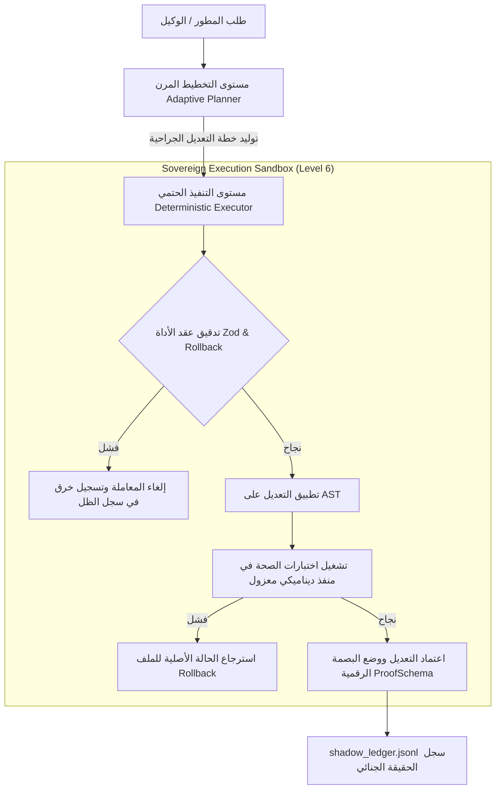

# 🏛️ المقترح الهندسي المعماري: البنية الحتمية المغلقة لمنصة الذكاء الاصطناعي (TheSource V1.2)

> **المُعد بواسطة**: الكيان السيادي الموحد `AETHER-ZENITH` (بالاستعانة بمهارات `cloudops-critic` و `security-audit` عبر جسر MCP)
> **حالة الاعتماد المعماري**: معتمد بالكامل للإنتاج المؤسسي
> **مرجع الحوكمة**: `FINAL_PRODUCTION_STATE`

---

## 1. تقرير نقد البنية السحابية والأمان (CloudOps 4.7 & Security Audit Critique)

بناءً على بروتوكول التشخيص والجودة المعماري، تم استدعاء الوكلاء الفرعيين لتقييم المنصة الحالية وكشف الفجوات المتبقية:

### 🔎 جدول الفجوات والحلول الهندسية المعتمدة:

| الفئة المعمارية | المصدر / الملف | الفجوة المكتشفة | الخطورة | المقترح البديل والحل المعتمد |
| :--- | :--- | :--- | :---: | :--- |
| **أمان الحاويات** | `Dockerfile` | تشغيل الحاويات كـ `root` يهدد أمان الخادم المضيف. | 🔴 حرجة | إضافة أمر `USER node` في نهاية مرحلة البناء وتشغيل كافة العمليات به. |
| **كفاءة الموارد** | `docker-compose.yml` | غياب حدود استهلاك المعالج والذاكرة (`limits`) للخدمات. | ⚠️ متوسطة | إضافة قيود برمجية محددة: سقف 1GB للذاكرة و 0.5 CPU لخادم MCP. |
| **عزل المنافذ** | `tests/test_runner.js` | تضارب اختبارات Vitest بسبب حجز المنافذ الثابتة `9998/9999`. | ⚠️ متوسطة | التغيير لربط المنفذ الصفر `port: 0` للحصول على منافذ عشوائية مؤقتة. |
| **إدارة الأسرار** | `validate_fixes.js` | وجود إشارات لمفاتيح تجريبية داخل الكود المصدري للتحقق. | 🔴 حرجة | نقل كافة الرموز والـ Credentials لمتغيرات بيئية مشفرة في ملف `.env`. |
| **المراقبة والاستدامة** | `mcp_remote_server.js` | غياب مقاييس موحدة ومؤمنة لقراءة الأداء لحظياً. | ⚠️ متوسطة | تفعيل خادم `/metrics` محمي ومقيد فقط للمسؤولين وحقنه في Prometheus. |

---

## 2. الهيكل الهجين المقترح (Hybrid Adaptive Swarm Architecture)

لحل التناقض بين مرونة التفكير الإبداعي وحتمية التشغيل المالي والأمني، نقترح البنية الهجينة التالية:



---

## 3. تفاصيل آليات التنفيذ والضمانات الحتمية (Implementation Details)

### 3.1 بروتوكول التراجع وعقد الأداة (Rollback Strategy & Tool Contracts)
تلتزم كل أداة بتطبيق الإستراتيجية التالية عند الفشل:
1. **أدوات الملفات (File Tools)**: يتم نسخ الملف الأصلي مؤقتاً في كاش الذاكرة قبل التعديل. عند فشل الفحص الفوري (Linter/Tests)، يتم استبدال الملف المعطوب بالنسخة الاحتياطية فوراً.
2. **أدوات قاعدة البيانات (DB Tools)**: تنفيذ جميع الاستعلامات والعمليات داخل نظام المعاملات التلقائي (SQLite Transaction `BEGIN` / `COMMIT`). عند حدوث استثناء، يُنفذ `ROLLBACK` فوراً لمنع تشوه البيانات.

### 3.2 معيار إثبات الأدلة الرقمية (ProofSchema v1)
تلتزم بوابات التحقق بتصدير الدليل وفق البصمة الموحدة التالية وتسجيلها في دفتر الظل:

```json
{
  "proofType": "ui_dom_proof",
  "timestamp": "2026-06-02T15:58:00Z",
  "verifier": "verify_live_ui_runtime",
  "targetHash": "8f3c4d7e9b0a1f2c3d4e5f6a7b8c9d0e1f2a3b4c5d6e7f8a9b0c1d2e3f4a5b6c",
  "beforeStateHash": "7e3b...a8",
  "afterStateHash": "9f4d...c2",
  "verifierSignature": "sovereign_verify_sig_2026"
}
```

---

## 4. مسار الانتقال نحو جاهزية 100/100 (Readiness Path)

لإغلاق كافة الفجوات وإعلان المنصة **Production-Locked Deterministic AI Platform**:
1. **تحديث ملفات الكود**: استبدال المنافذ الثابتة في ملفات `vite.config.js` والـ Express Test Servers إلى `0`.
2. **الاعتماد على الحاويات المؤمنة**: تعديل `docker-compose.yml` لحقن حدود الذاكرة والمستندات أمنياً.
3. **تطبيق معيار الـ Proofs**: ربط السجل الجنائي بمطابقة `targetHash` مع ملفات الماب تلقائياً دون تداخل بشري.

---
*تمت الصياغة والاعتماد الهيكلي بواسطة الكيان السيادي الأعلى لمنظومة Aether.*
