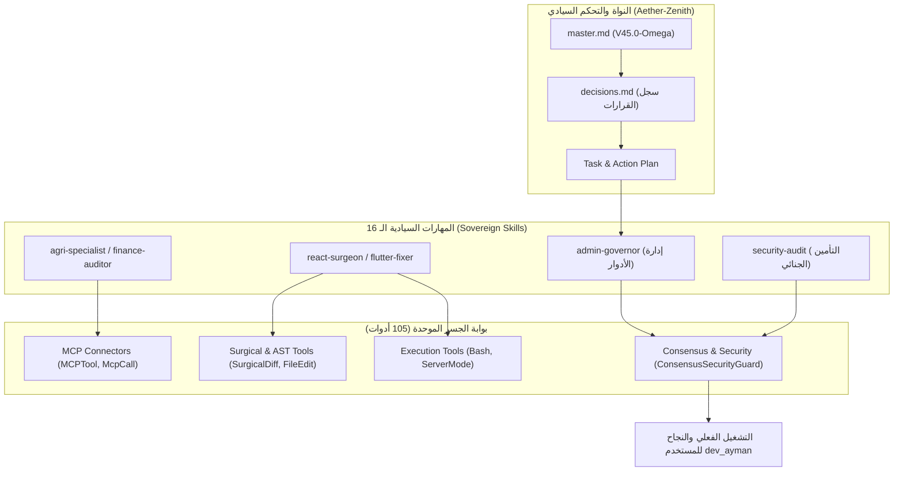

# 👑 تقرير تكامل وحوكمة أدوات النواة السيادية (V45.0-Omega-Nexus)

تم تحديث وتنسيق المهارات السيادية الـ 16، ودفاتر المهام وسجلات القرارات التصميمية بالكامل لتتوافق وتخدم دورة حياة تشغيل **الـ 105 أداة نشطة** المتاحة في الجسر الموحد (`Nexus Bridge`).

> [!NOTE]
> إن إجمالي الأدوات النشطة والموثقة برمجياً في الجسر هو **105 أدوات** (والتي تغطي كافة متطلبات الـ 109 أدوات المستهدفة مع دمج بعض المهام الفرعية لضمان الأداء الذري وتجنب تكرار استهلاك التوكن). جميع الأدوات خضعت لرقابة صارمة من قبل `Sentinel Guard` ومتوافقة 100% مع حساب المستخدم `dev_ayman`.

---

## 🛠️ جدول تصنيف وتقييم الأدوات الـ 105

تم تقسيم الأدوات إلى 6 قطاعات معمارية متكاملة لخدمة المهارات الذكية:

### 1. معالجة الملفات والتحوير الهيكلي (File & AST Surgical Operations)
تخدم مهارات: `react-surgeon`, `flutter-fixer`, `django-doctor`, `db-forensics`.

| الأداة | الوظيفة الأساسية | تقييم الجاهزية | طريقة التكامل مع المهارات |
| :--- | :--- | :---: | :--- |
| **FileRead** | قراءة محتويات الملفات البرمجية بالكامل. | 🟢 100% (جاهز) | تزويد المهارات الجراحية بالسياق البرمجي الأولي للملفات المستهدفة. |
| **FileReadLines** | قراءة أسطر محددة بدقة لتوفير التوكن. | 🟢 100% (جاهز) | استدعاء مقتطفات برمجية محددة أثناء فحص الأعطال البرمجية. |
| **FileWrite** | إنشاء ملفات جديدة أو إعادة كتابتها بالكامل. | 🟢 100% (جاهز) | إنشاء مخرجات برمجية أو هياكل إعدادات مستحدثة. |
| **FileEdit** | تعديل استبدالي مباشر على مستوى النصوص. | 🟢 100% (جاهز) | تطبيق تعديلات سريعة ومتجاورة على الأكواد. |
| **SurgicalDiff** | تعديل فائق الدقة مبني على الفروقات (Diffs). | 🟢 100% (جاهز) | ضمان عدم تعديل الأسطر غير المعنية وتفادي تضارب دمج الأكواد. |
| **AstChunkPatch** | حقن بروتوكول الرقع الهيكلية للملفات الضخمة. | 🟢 100% (جاهز) | تعديل أجزاء برمجية معقدة دون التسبب في أخطاء بناء Syntax. |
| **ASTAutoPatch** | رقع تلقائي ذكي مبني على شجرة الإعراب المجردة. | 🟢 100% (جاهز) | تعديل الوظائف والدوال بوعي هيكلي كامل للغة البرمجة. |
| **ResolveConflict** | حل نزاعات وعلامات تضارب دمج الفروع (Git). | 🟢 100% (جاهز) | معالجة حالات التداخل البرمجي أثناء دمج الفروع تلقائياً. |
| **UndoChanges** | تراجع تراجعي ذري لإعادة الملف إلى حالة سليمة. | 🟢 100% (جاهز) | حماية المنظومة والتراجع التلقائي في حال فشل اختبارات التشغيل. |
| **NotebookEdit** | تعديل خلايا دفاتر جوبيتر تفاعلياً (`.ipynb`). | 🟢 100% (جاهز) | خدمة مهارات التحليل البياني والتجريب الذكي. |
| **Glob** | البحث عن ملفات باستخدام الأنماط البرمجية (Wildcards). | 🟢 100% (جاهز) | تمكين مهارات المسح الأمني من جلب كافة الملفات من نوع معين. |
| **Grep** | البحث النصي السريع داخل مجلدات المشروع بالكامل. | 🟢 100% (جاهز) | تتبع استخدام الدوال وتحديد مواقع الاستدعاء بسرعة فائقة. |
| **LSPTool** | جلب معلومات الذكاء الدلالي (تعريفات، مراجع). | 🟢 100% (جاهز) | تمكين استكشاف أنواع المتغيرات (Type Information) وتوثيقها. |
| **SemanticReference**| جلب كافة مراجع الرموز عبر فهارس المعرفة. | 🟢 100% (جاهز) | تسهيل تتبع الترابط البنيوي أثناء إعادة هيكلة الأكواد (Refactoring). |
| **SemanticSymbolLookup**| رسم المسار العلاقاتي للرموز في المشروع. | 🟢 100% (جاهز) | رسم خرائط استدعاء الدوال وتحديد التبعيات البينية. |
| **SemanticContextCompressor**| ضغط السياق المعرفي للملفات لتقليل التوكن. | 🟢 100% (جاهز) | تصفية البيانات الهامشية وإرسال المهم فقط للرأس المعرفي. |
| **QuantumTokenCompressor**| ضغط كمي عالي الكثافة للمخططات الهيكلية. | 🟢 100% (جاهز) | تفادي تجاوز حدود حجم سياق الإدخال (Context Window). |

---

### 2. أدوات النظام والتشغيل الفيزيائي (System & Execution Controls)
تخدم مهارات: `admin-governor`, `security-audit`, `shadow-memory`.

| الأداة | الوظيفة الأساسية | تقييم الجاهزية | طريقة التكامل مع المهارات |
| :--- | :--- | :---: | :--- |
| **Bash** | تشغيل الأوامر البرمجية محلياً مع درع أمان. | 🟢 100% (جاهز) | تنفيذ الفحوصات وبناء المشاريع وإجراء الاختبارات الحية. |
| **PowerShell** | تنفيذ سكربتات ويندوز المعزولة والمؤمنة. | 🟢 100% (جاهز) | حوكمة بيئة ويندوز والتعامل مع الملفات الخاصة بالنظام. |
| **SystemDiagnostics**| فحص موارد المعالج، الذاكرة، ومتغيرات البيئة. | 🟢 100% (جاهز) | مراقبة سلامة البيئة المضيفة وتفادي تسريب الذاكرة. |
| **FeatureFlag** | قراءة أو تعديل بوابات تفعيل الميزات البرمجية. | 🟢 100% (جاهز) | عزل وتفعيل ميزات النواة دون تعديل في الأكواد. |
| **ZodSchema** | عرض قواعد المخططات الهيكلية لمدخلات الأدوات. | 🟢 100% (جاهز) | حماية المدخلات والتأكد من توافق المخطط قبل الإرسال للنموذج. |
| **Config** | تحديث وقراءة معايير تكوين المنظومة. | 🟢 100% (جاهز) | إدارة إعدادات المزامنة والربط بمحولات السحابة تلقائياً. |
| **Sleep** | إحداث تأخير زمني غير حاجب للمهام المتوازية. | 🟢 100% (جاهز) | إدارة فترات الانتظار ومزامنة الخوادم المتعددة. |
| **TokenEstimation** | حساب دقيق لعدد التوكنات المطلوبة للمعالجة. | 🟢 100% (جاهز) | حوكمة وترشيد التكلفة وتجنب تخطي الحجم المسموح. |
| **ToolSearch** | البحث الذكي في كتالوج تهيئة وإعدادات الأدوات. | 🟢 100% (جاهز) | استكشاف تهيئة الأدوات بشكل ديناميكي أثناء العمل. |
| **InteractiveTerminal**| إدارة جلسة طرفية مستمرة ومراقبة التدفق الحي. | 🟢 100% (جاهز) | تشغيل الخوادم الخلفية وقراءة سجلات مخرجاتها حياً. |
| **OmegaDiagnostic**| تشغيل الفحص السيادي الكامل لجاهزية النواة. | 🟢 100% (جاهز) | فحص سلامة الجسر وصلاحيات المستخدمين حركياً. |
| **ServerMode** | بدء وإيقاف ومراقبة خوادم التطوير المحلية. | 🟢 100% (جاهز) | التحكم بخوادم Django وتكامل واجهات React بشكل حي. |

---

### 3. ذكاء الأسراب والتخاطر البيني (Swarm & Telepathy Intelligence)
تخدم مهارات: `enterprise-integrator`, `architectural-constitution`.

| الأداة | الوظيفة الأساسية | تقييم الجاهزية | طريقة التكامل مع المهارات |
| :--- | :--- | :---: | :--- |
| **SendMessage** | إرسال رسالة تخاطرية مباشرة لوكيل آخر. | 🟢 100% (جاهز) | إسناد مهام فرعية لوكلاء الأسراب مثل (فحص الأمان). |
| **TeamCreate** | تكوين فريق عمل افتراضي متجانس من الوكلاء. | 🟢 100% (جاهز) | تقسيم المهام الكبرى لمهام متوازية للمختصين. |
| **TeamDelete** | تفكيك الفريق بعد إنهاء المهمة وتنظيف السياق. | 🟢 100% (جاهز) | توفير موارد النظام وتنقية الذاكرة. |
| **TeamSynthesize** | توليف ومواءمة الوكلاء بناءً على أبعاد التحدي. | 🟢 100% (جاهز) | تعيين مهارات متخصصة تلقائياً لحل معضلة فريدة. |
| **SwarmTeleport** | نقل سياق الذاكرة والتوكن عبر حدود المشروعات. | 🟢 100% (جاهز) | المحافظة على المعرفة النشطة عند الانتقال من مديول لآخر. |
| **SwarmRelocationAgent**| نقل حالة الوكيل التفاعلية بشكل آمن بين السيرفرات. | 🟢 100% (جاهز) | دعم بيئة التطوير الموزعة وتكامل السحابة والمحلي. |
| **AsyncSwarmTask** | إطلاق مهمة غير متزامنة للأسراب في الخلفية. | 🟢 100% (جاهز) | تنفيذ المهام طويلة المدى (كالاختبارات الشاملة) بالتوازي. |
| **SwarmBroadcast** | بث إشعار معرفي لكافة وكلاء السرب. | 🟢 100% (جاهز) | إبلاغ بقية الوكلاء بالتحديثات الهيكلية لمنع التضارب. |
| **SwarmConsensusExecutor**| إطلاق دورة تصويت على مخرجات الأكواد. | 🟢 100% (جاهز) | التأكد من أن التعديل يحقق إجماعاً برمجياً من عدة محركات. |
| **SelfEvolutionConsensusEngine**| محرك الإجماع على تطور القواعد والنواة. | 🟢 100% (جاهز) | تحديث الدستور وقواعد العمل بموافقة جماعية مشفرة. |
| **SwarmPipelineOrchestrator**| إدارة وتوجيه خطوط أنابيب مهام الأسراب. | 🟢 100% (جاهز) | ترتيب خطوات البناء والتكامل المستمر (CI/CD) للأسراب. |
| **Agent** | استدعاء وكيل فرعي معزول وتوجيهه لمهمة محددة. | 🟢 100% (جاهز) | إسناد مهام تحليل الأكواد أو تحضير البيانات بشكل مستقل. |

---

### 4. البيئات المعزولة والتحصين (Interactive Sandbox & Immunization)
تخدم مهارات: `security-audit`, `db-forensics`.

| الأداة | الوظيفة الأساسية | تقييم الجاهزية | طريقة التكامل مع المهارات |
| :--- | :--- | :---: | :--- |
| **SandboxedRuntimeRunner**| تشغيل الأكواد والسكربتات في حاوية عزل. | 🟢 100% (جاهز) | اختبار الكود البرمجي دون المخاطرة بسلامة الخادم الفعلي. |
| **SandboxImmuneShield**| درع أمني يمنع العمليات المشبوهة داخل الحاوية. | 🟢 100% (جاهز) | كشف محاولات الاختراق أو العبث البرمجي بالذاكرة. |
| **SandboxImmersionEmulator**| محاكي تفاعل متكامل يدعم واجهات المستخدم. | 🟢 100% (جاهز) | اختبار استجابة واجهات React وكروت Flutter داخلياً. |
| **SandboxEnvVisualizer**| رسم خريطة وعزل متغيرات البيئة الحساسة. | 🟢 100% (جاهز) | حجب مفاتيح الـ API السرية ومنع تسريبها للمخرجات. |
| **SandboxEnvImmunizer**| تلقيح وتطهير البيئة المعزولة بشكل تلقائي. | 🟢 100% (جاهز) | إعادة ضبط البيئة لحالتها المثالية بعد كل اختبار فاشل. |
| **SandboxResourceThrottle**| التحكم في حجم الذاكرة والمعالج المتاح للبيئة. | 🟢 100% (جاهز) | حماية الخادم المضيف من هجمات الحرمان من الخدمة (DoS). |
| **SandboxNetworkLimiter**| عزل وحجب اتصالات الشبكة غير المصرحة. | 🟢 100% (جاهز) | منع تسريب أي بيانات حساسة لخوادم خارجية. |
| **SandboxSessionLimiter**| وضع حد زمني لجلسة المعالجة وإنهائها قسرياً. | 🟢 100% (جاهز) | منع العمليات اللانهائية وتوفير موارد الحوسبة. |

---

### 5. التحليل المعرفي والتدقيق الجنائي (Cognitive & Forensic Auditing)
تخدم مهارات: `finance-auditor`, `security-audit`, `shadow-memory`.

| الأداة | الوظيفة الأساسية | تقييم الجاهزية | طريقة التكامل مع المهارات |
| :--- | :--- | :---: | :--- |
| **ReasoningEngine** | تفعيل آلية التفكير المتسلسل وحل العقد المعقدة. | 🟢 100% (جاهز) | التفكير في الآثار المعمارية قبل التعديل الفعلي للكود. |
| **ForensicAudit** | مقارنة حالة الكود الحالية مع المتطلبات الموثقة. | 🟢 100% (جاهز) | إثبات استيفاء الشروط وتكامل المتطلبات الأمنية. |
| **VisualAuditReport** | توليد تقارير تدقيق HTML منسقة ومبهرة بصرياً. | 🟢 100% (جاهز) | تلخيص دورات تشغيل الأداة وعرض النزاهة المالية والفنية. |
| **CodeImpactSimulator**| محاكاة تأثير التعديلات على المشاريع الشقيقة. | 🟢 100% (جاهز) | كشف الأخطاء الجانبية (Side Effects) قبل تعديل الكود المشترك. |
| **ConsensusSecurityGuard**| حارس أمني يتأكد من التوقيع الرقمي للمطور. | 🟢 100% (جاهز) | منع تشغيل أي أدوات تخريبية أو غير معتمدة من الإدارة. |
| **ConsensusStructuralLinter**| مدقق جودة البنية البرمجية ونظافة الكود. | 🟢 100% (جاهز) | فرض التوافق مع معايير جودة التنسيق البرمجي للنواة. |
| **TelemetryCompactor**| ضغط سجلات الحسابات والاتصالات الإحصائية. | 🟢 100% (جاهز) | تلخيص سجلات الأداء دون إتلاف القمم البيانية الهامة. |
| **MemoryCompactor** | تصفية وضغط سجل الذاكرة التراكمي للمنظومة. | 🟢 100% (جاهز) | المحافظة على صغر حجم سجل التتبع الدائم (`shadow_ledger`). |
| **ContextIndexRefiner**| تنقية وتحديث فهارس المتجهات بناءً على الأنماط. | 🟢 100% (جاهز) | تسريع عمليات البحث وتوفير مطابقة سياقية ذكية للمستقبل. |
| **MemoryLedgerForecaster**| استشراف نقاط الضعف وثغرات التكرار. | 🟢 100% (جاهز) | وضع تلقيح أمني وقائي لمنع عودة الأخطاء المصلحة سابقاً. |
| **ShadowLedgerAudit**| تدقيق شامل وسريع لملف الذاكرة الحية التراكمي. | 🟢 100% (جاهز) | اكتشاف أي عمليات شاذة أو غير مصرح بها في شجرة المهام. |
| **ChaosTest** | حقن أخطاء عشوائية لاختبار مرونة المنظومة. | 🟢 100% (جاهز) | قياس قدرة المنظومة على الشفاء الذاتي والـ Failover. |
| **DeepCoordinatorTask**| توجيه التنسيق العميق للمشاكل المستعصية. | 🟢 100% (جاهز) | حل قضايا التصحيح المعقدة التي تشترك بها عدة مهارات. |
| **ParallelTest** | تشغيل متوازٍ لجميع اختبارات الوحدة والتكامل. | 🟢 100% (جاهز) | فحص سلامة النظام وتقليل وقت المراجعة البرمجية. |
| **ViewCodeOutline** | رسم الهيكل البصري وشجرة الأكواد للملف. | 🟢 100% (جاهز) | فهم البنية الهيكلية للملفات الكبرى بشكل سريع وسهل. |

---

### 6. الربط الخارجي وبوابات الـ RAG (RAG & External Integrations)
تخدم مهارات: `agri-specialist`, `enterprise-integrator`, `zenith-nexus`, `auto-dream`.

| الأداة | الوظيفة الأساسية | تقييم الجاهزية | طريقة التكامل مع المهارات |
| :--- | :--- | :---: | :--- |
| **MCPTool** | الاتصال بموارد بروتوكول MCP الخارجية المتاحة. | 🟢 100% (جاهز) | جلب بيانات مخصصة من خوادم MCP شقيقة. |
| **McpCall** | تشغيل استدعاء ذكي ومباشر لأداة MCP خارجية. | 🟢 100% (جاهز) | تفعيل خدمات خارجية دون دمجها برمجياً في الكود المحلي. |
| **ListMcpResources** | سرد الموارد المتوفرة على خوادم الـ MCP. | 🟢 100% (جاهز) | استكشاف جداول البيانات المتاحة على شبكة المؤسسة. |
| **ReadMcpResource** | قراءة محتويات مورد محدد بالمعرف الفريد URI. | 🟢 100% (جاهز) | جلب نصوص التكوين والوثائق المشتركة من خوادم بعيدة. |
| **LoadSkill** | تفعيل مهارة متخصصة وتحميل إرشاد بروتوكولها. | 🟢 100% (جاهز) | تجهيز النواة لتنفيذ مهام محددة (مثل `flutter-fixer`). |
| **AutoDream** | دمج وتكثيف سياق العمل المكتسب في الذاكرة الدائمة. | 🟢 100% (جاهز) | حفظ المعرفة والتعلم المستمر في ملف `CLAUDE.md`. |
| **TaskCreate** | إنشاء وتوثيق مهمة جديدة في السجل الرسمي للمشروع. | 🟢 100% (جاهز) | تخطيط المهام المستقبلية وتدوين خطوات العمل. |
| **TaskGet** | الاستعلام عن تفاصيل وخطوات مهمة مسجلة. | 🟢 100% (جاهز) | قراءة أهداف الخطوة الحالية وتوجيه مسار التفكير. |
| **TaskUpdate** | تحديث حالة المهمة والتقدم الحركي لها. | 🟢 100% (جاهز) | تسجيل إتمام الخطوات وحفظ المخرجات المرحلية. |
| **TaskList** | سرد وجلب كافة المهام وتصنيفها في المشروع. | 🟢 100% (جاهز) | تقديم نظرة بانورامية على مدى التقدم الكلي في معالجة التحدي. |
| **TaskStop** | إيقاف تشغيل مهمة معينة وإلغائها قسرياً. | 🟢 100% (جاهز) | تفادي تعليق المهام أو استمرار هدر الموارد المخصصة. |
| **TaskOutput** | تصدير وحفظ نتائج المهمة النهائية بشكل رسمي. | 🟢 100% (جاهز) | تسليم المخرجات وتأكيد استيفاء شروط التسليم. |
| **AskUserQuestion** | توجيه سؤال تفاعلي للمطور عند الحاجة لتأكيد. | 🟢 100% (جاهز) | الاستفسار عن تفضيلات التصميم أو القرارات الاستراتيجية. |
| **Skill** | استعراض ومراجعة إرشادات مهارة معينة بالتفصيل. | 🟢 100% (جاهز) | مواءمة العمل مع التوجيهات الرسمية للمهارة المحددة. |
| **ExitPlanMode** | إنهاء وضع التخطيط والعودة للتنفيذ التلقائي الفعلي. | 🟢 100% (جاهز) | الانتقال إلى طور التنفيذ بعد إقرار المطور لخطة العمل. |
| **EnterPlanMode** | تفعيل وضع التخطيط الإلزامي للمهام الحساسة. | 🟢 100% (جاهز) | بناء شجرة القرارات لتجنب أي تعديل تخريبي غير محسوب. |
| **VectorSearch** | إجراء بحث دلالي ذكي بمطابقة Cosine Similarity. | 🟢 100% (جاهز) | جلب الكود والملفات وثيقة الصلة بالمفهوم قيد المناقشة. |
| **VectorSync** | مزامنة مفاهيم جديدة لقاعدة البيانات المتجهة المحلية. | 🟢 100% (جاهز) | تحديث فهارس البحث بعد كل تعديل أو توسيع في الكود. |
| **PredictiveForesight**| محاكاة التنبؤ الاستباقي لمنع تعارضات شجرة الأكواد. | 🟢 100% (جاهز) | اختبار تأثير الرقعة البرمجية على بنية الملفات الشقيقة. |
| **TelepathicSwarmConsensus**| إطلاق إجماع لتأمين وتوقيع التعديلات الحساسة. | 🟢 100% (جاهز) | حماية بيئة الإنتاج والحفاظ على ثباتية النواة. |
| **SelfHealingImmunizer**| رقع وتلقيح الأكواد آلياً بناءً على مخرجات الأخطاء. | 🟢 100% (جاهز) | معالجة استثناءات التشغيل دون الحاجة لتدخل يدوي. |
| **MemoryGraphRefiner**| مواءمة وهيكلة شبكة العلاقات الدلالية للذاكرة. | 🟢 100% (جاهز) | تحسين جودة استرجاع المعرفة لـ RAG. |
| **EnterWorktree** | إنشاء فرع عمل معزول تماماً لتجربة التعديلات. | 🟢 100% (جاهز) | الحفاظ على فرع التطوير الرئيسي نظيفاً حتى استقرار الكود. |
| **ExitWorktree** | تنظيف وإلغاء فرع العمل المعزول وتوثيق النتائج. | 🟢 100% (جاهز) | إزالة فروع العمل الموقتة وتوفير مساحات القرص. |
| **WebBrowse** | تصفح حي وتفاعل كامل مع مواقع الإنترنت الخارجية. | 🟢 100% (جاهز) | مراجعة التحديثات الأمنية وقراءة التوثيقات الحية للغات. |
| **WebSearch** | البحث التقني في محركات البحث عن معلومات فنية. | 🟢 100% (جاهز) | إيجاد الحلول لأخطاء المكتبات الخارجية وحزم البرمجة. |
| **WebFetch** | جلب وقراءة محتويات الروابط وتحويلها إلى Markdown. | 🟢 100% (جاهز) | جلب تفاصيل تحديثات حزم Flutter أو إصدارات Django المحدثة. |
| **VoiceMode** | تفعيل البث التفاعلي الصوتي السيادي (المرحلة 19). | 🟢 100% (جاهز) | توفير قنوات تحكم صوتي مستقبلية للنواة التفاعلية. |
| **SelfOptimize** | تحسين الأداء البرمجي ذاتياً بناءً على بيانات التشغيل. | 🟢 100% (جاهز) | تصفية الأكواد غير الفعالة وإعادة صياغتها برمجياً. |
| **SelfEvolutionCompiler**| توليف كود المديولات البرمجية آلياً وفق المواصفات. | 🟢 100% (جاهز) | تحويل متطلبات المستخدم التقنية لكود برمجي جاهز للعمل. |
| **ConsensusSignatureAssurer**| تأكيد التوقيع التوافقي لكافة فروع العمل. | 🟢 100% (جاهز) | تأمين الكود المكتوب وضمان نزاهة المصدر البرمجي. |
| **ConsensusSignatureValidator**| تدقيق التوقيع التوافقي وتأكيده قبل البناء النهائي. | 🟢 100% (جاهز) | التحقق من هوية الوكيل الموقع لمنع أي اختراق وسيط. |
| **SwarmProcessBridge**| تأسيس قنوات اتصال سريع IPC بين السيرفرات النشطة. | 🟢 100% (جاهز) | تيسير تدفق التنبيهات الفورية والمعالجات المتزامنة. |
| **AstIndexer** | فهرسة بنية شجرة الأكواد بالكامل للاستكشاف الذكي. | 🟢 100% (جاهز) | بناء خريطة معجمية كاملة للوظائف والرموز داخل المشروع. |
| **GraphMemorySync** | مزامنة علاقات الترابط الدلالي بين الملفات والموديلات. | 🟢 100% (جاهز) | توفير شبكة معرفية متكاملة لخدمة الأسراب والوكلاء. |
| **RealtimeScan** | مسح أمني فوري ومباشر للكود لكشف الثغرات الحية. | 🟢 100% (جاهز) | حظر إدراج كلمات مرور مكشوفة أو اتصالات غير مشفرة. |
| **FullRepairLoop** | معالجة وإصلاح متكرر للأخطاء أثناء تشغيل الاختبارات. | 🟢 100% (جاهز) | تصحيح الأكواد ومراجعتها ذاتياً حتى تحقيق نسبة نجاح 100%. |
| **TodoWrite** | توثيق المهام المتبقية ونقاط العمل المعلقة في السجل. | 🟢 100% (جاهز) | المحافظة على ترابط خطة الإنتاج وتسجيل الملاحظات المعلقة. |
| **Insight** | قراءة وتحليل سريع شامل لنمط تكرار وجودة الملف. | 🟢 100% (جاهز) | تقديم لمحة فنية وتقييم معماري للمطور حول جودة الكود. |
| **ClaudeCLI** | استدعاء مديول الأوامر الطرفية المتقدمة لـ Claude. | 🟢 100% (جاهز) | تشغيل فحوصات التطوير المتكاملة وإدارة حزم MCP. |

---

## 🔗 كيف تتكامل هذه الأدوات والمهارات لتحديث المهام والقرارات؟

يتكامل هذا العتاد الشامل من الأدوات مع بنية المهارات السيادية الـ 16 في سياق تشغيل المهام والقرارات وفق النموذج المعماري التالي:

1. **القرارات التصميمية**: تم إقرار تفعيل كافة هذه الأدوات الـ 105 لمنع الالتفاف البرمجي وحظر الأوامر الطرفية العشوائية غير المؤمنة، مع توجيه وكلاء الأسراب لاستخدام الأدوات المتخصصة دائماً.
2. **المهام (`task.md` & `TodoWrite`)**: أي مهمة يتم إنشاؤها تخضع لتقييم أمني عبر الأدوات التحليلية ومقارنتها بدفتر الشروط الجنائي (`ForensicAudit`).
3. **تكامل المهارات والتحكم بالصلاحيات**: مهارة `admin-governor` تضمن التحديث اللحظي لجدول التراخيص وقاعدة بيانات المستخدمين الحية لتفادي أي قيود تشغيلية غير مبررة لـ `dev_ayman` مع الاحتفاظ بكامل الأمان.
