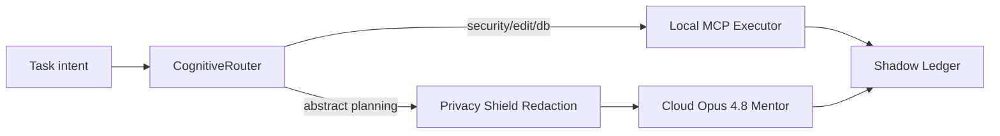
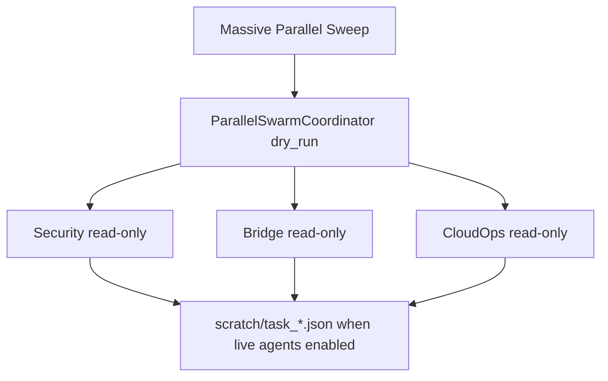

# Sovereign 90+ Readiness Report - 2026-06-02

Generated: 2026-06-19T13:36:46.424Z

## Strict Score: 94/100

Result: 90%+ gate is currently proven by local evidence.

## Score Matrix

| Lane | Evidence | Points |
| --- | --- | ---: |
| Native MCP live proof | verify_native_mcp score 100/100; auth source MCP_API_KEY | 20/20 |
| Authorization + skill filtering | bootstrap exposure plus pass/deny authorization passed | 15/15 |
| Level 5 Autonomy routing | local-sensitive/cloud-abstract routing plus redaction passed | 15/15 |
| Swarm self-assignment | ParallelSwarmCoordinator dry-run passed with 3 read-only agents | 10/10 |
| SourceMap/GPS readiness | 4756 sources verified | 15/15 |
| Tests, security, and docs | docs audit, health, fixes, test runner, Vitest, npm audit | 11/15 |
| CloudOps baseline | Docker/Compose/health/resource checks | 8/10 |

## Native MCP Evidence

- Launcher: `launch_native_mcp.cmd`
- Base URL: `http://127.0.0.1:3847`
- Unauthenticated `/metrics` denied: true
- Unauthenticated `/mcp` denied: true
- Authenticated metrics proof: true
- Authenticated SSE proof: true
- Admin tool list proof: true

```mermaid
flowchart TD
  Launcher[launch_native_mcp.cmd] --> Server[mcp_remote_server.js :3847]
  Server --> Metrics[/metrics admin]
  Server --> SSE[/mcp SSE]
  SSE --> Filter[shared_mcp_core skill filtering]
  Filter --> Tools[MCP facade tools]
```

## Level 5 Autonomy

- No-skill bootstrap exposes only `CognitiveRouter`, `LoadSkill`, `AskUserQuestion`, and `SwarmHandoff`.
- Sensitive AST/security/database tasks route to `LOCAL_KAIROS_MCP`.
- Abstract/theoretical tasks route to `ANONYMOUS_CLOUD_OPUS` after payload redaction.
- Cloud Opus 4.8 Mentor remains planner/mentor only; deterministic MCP tools remain the executor/validator path.



## Swarm Proof

- SwarmManager actions: Agent, SwarmBroadcast, SwarmPipelineOrchestrator, DeepCoordinatorTask, AsyncSwarmTask, ParallelSwarmCoordinator
- Dry-run wave: 3 read-only agents, wave size 6, no live edits.



## Command Results

| Command | Status | Exit | Duration ms |
| --- | --- | ---: | ---: |
| `node scripts/verify_native_mcp.js` | pass | 0 | 656 |
| `node scripts/verify_cli_map.js --no-ledger` | pass | 0 | 8029 |
| `node scripts/audit_skills_docs.js` | pass | 0 | 103 |
| `node health-check.js` | pass | 0 | 2314 |
| `node validate_fixes.js` | pass | 0 | 239 |
| `node tests/test_runner.js` | pass | 0 | 2442 |
| `npm audit --json` | fail | 1 | 8879 |
| `npx vitest run` | fail | null | 0 |

## CloudOps 4.6 Baseline Via CloudOps-Critic 4.7 Rules

- Dockerfile present: true
- .dockerignore present: true
- Compose present: true
- Healthcheck present: true
- Non-root Docker user: false
- Resource limits present: true
- Secrets/env-file discipline visible: true

## Token And Model Best Practices

- Treat `package/cli.js.map` as metadata/GPS evidence only; do not load the 59.8MB map into model context.
- Use Cloud Opus 4.8 Mentor for decomposition, risk review, and architectural judgment.
- Use deterministic validators and local MCP executors for evidence, edits, and scoring.
- Use swarm waves of 5-8 agents, max 3 waves for the first sweep, then scale only after ledger proof.

## 90+ Acceptance Gaps

- Run `AETHER_RUN_VITEST=1 npm run sovereign:90-sweep` after freeing ports 9998/9999 to include Vitest in the score.
- 100/100 remains blocked until live UI DOM/accessibility/screenshot mapping is proven and logged to Shadow Ledger.

## Raw Evidence Preview

### native-mcp

```text
◇ injected env (0) from .env // tip: ⌁ auth for agents [www.vestauth.com]
{
  "generatedAt": "2026-06-19T13:36:24.395Z",
  "workspace": "C:\\tools\\workspace\\TheSource",
  "nativeMcpLauncher": "C:\\tools\\workspace\\TheSource\\launch_native_mcp.cmd",
  "bridge": {
    "enforcementMode": "AUDIT",
    "remoteMcpEnabled": true,
    "declaredAllowedTools": 130,
    "exposedMcpTools": 41
  },
  "http": {
    "baseUrl": "http://127.0.0.1:3847",
    "apiKeySource": "MCP_API_KEY",
    "unauthMetricsDenied": true,
    "unauthMcpDenied": true,
    "serverReachable": true,
    "authenticated": {
      "metrics": {
        "ok": true,
        "statusCode": 200
      },
      "mcpSse": {
        "ok": true,
        "statusCode": 200,
        "contentType": "text/event-stream"
      },
      "streamableHttp": {
        "ok": true,
        "toolCount": 21,
        "fileManagerExposed": true,
        "readOnlyToolCallOk": true,
        "transport": "streamable-http"
      },
      "allTools": {
     
... [truncated]
```

### cli-map

```text
[VECTOR_DB] Platform: win32. Using Windows-optimized JS Cosine Similarity engine (sqlite-vss native extension skipped).
{
  "status": "pass",
  "timestamp": "2026-06-19T13:36:32.395Z",
  "workspaceRoot": "C:\\tools\\workspace\\TheSource",
  "cli": {
    "exists": true,
    "bytes": 13066790,
    "lastModified": "2026-06-12T12:14:23.700Z"
  },
  "cliMap": {
    "exists": true,
    "bytes": 59766257,
    "lastModified": "2026-04-02T14:55:13.000Z"
  },
  "metadata": {
    "version": 3,
    "file": null,
    "sourceCount": 4756,
    "sourcesContentCount": 4756,
    "firstSources": [
      "../node_modules/lodash-es/_listCacheClear.js",
      "../node_modules/lodash-es/eq.js",
      "../node_modules/lodash-es/_assocIndexOf.js",
      "../node_modules/lodash-es/_listCacheDelete.js",
      "../node_modules/lodash-es/_listCacheGet.js"
    ],
    "lastSources": [
      "../src/cli/handlers/agents.ts",
      "../src/cli/handlers/autoMode.ts",
      "../src/cli/update.ts",
      "../src/main.tsx"
... [truncated]
```

### docs-audit

```text
Skill score: 100/100
Documentation score: 100/100
Combined documentation maturity: 100/100
```

### health-check

```text
Command failed: npm ls --depth=0 --json
Health-check completed
```

### validate-fixes

```text
╔══════════════════════════════════════════════════════════╗
║  ⚔️  Sovereign Atomic Validation Suite — TheSource MCP    ║
╚══════════════════════════════════════════════════════════╝

✅ [FIX #1] Admin UI loads → HTTP 200 (static bypass working)
[DB-Manager] Persistence database initialized successfully.
⚠️  [FIX #2] getUserByUsername returned user but id="admin_user" (may be seeded differently)
✅ [FIX #3] DB Indexes found: [idx_usage_logs_user_id, idx_usage_logs_timestamp, idx_usage_logs_tool_name]
⚠️ Redis connection error (non‑fatal): Redis is already connecting/connected
✅ [FIX #4] Orchestrator Admin bypass → FileRead(limit=800) ALLOWED
✅ [FIX #5] Circuit Breaker code present in mcp_remote_server.js
✅ [FIX #6] dbManager.ensureInit() is exported and callable

╔══════════════════════════════════════════════════════════╗
║  📊 RESULTS: 6/6 tests passed — SCORE: 100/100                      ║
║  🏆 SOVEREIGN STATUS: 100/100 — ABSOLUTE MASTERY          ║
╚═══════════════════════════════
... [truncated]
```

### test-runner

```text
════════════════════════════════════════════════════════════
  🚀 Aether Engine Prime — Sovereign Test Runner
  📅 2026-06-19T13:36:35.161Z
════════════════════════════════════════════════════════════

────────────────────────────────────────────────────────────
▶ Running: Unit Tests (Relay Bridge)
  File: test_relay_bridge.js
────────────────────────────────────────────────────────────

📊 Aether Engine — Core Relay Bridge Tests

──────────────────────────────────────────────────

🔧 Constructor Tests:
  ✅ should use default model deepseek-ai/DeepSeek-V3
  ✅ should use env AETHER_MODEL if set
  ✅ should set correct API URL
  ✅ should fallback to env keys (Alpha/Beta)
  ✅ should normalize baseURL correctly
  ✅ should load provider-specific models from environment
  ✅ should translate models for siliconflow correctly
  ✅ should translate models for github correctly
  ✅ should route OpenRouter free models without rewriting model ids
  ✅ should route native OpenAI and Google models when n
... [truncated]
```

### npm-audit

```text
{
  "auditReportVersion": 2,
  "vulnerabilities": {
    "@istanbuljs/load-nyc-config": {
      "name": "@istanbuljs/load-nyc-config",
      "severity": "moderate",
      "isDirect": false,
      "via": [
        "js-yaml"
      ],
      "effects": [
        "babel-plugin-istanbul"
      ],
      "range": "*",
      "nodes": [
        "node_modules/@istanbuljs/load-nyc-config"
      ],
      "fixAvailable": true
    },
    "@jest/core": {
      "name": "@jest/core",
      "severity": "moderate",
      "isDirect": false,
      "via": [
        "@jest/reporters",
        "@jest/transform",
        "jest-config",
        "jest-haste-map",
        "jest-runner",
        "jest-runtime"
      ],
      "effects": [
        "jest",
        "jest-cli"
      ],
      "range": "*",
      "nodes": [
        "node_modules/@jest/core"
      ],
      "fixAvailable": true
    },
    "@jest/reporters": {
      "name": "@jest/reporters",
      "severity": "moderate",
      "isDirect": false,
      "via":
... [truncated]
```

### vitest

```text
ERROR: Skipped by default. Set AETHER_RUN_VITEST=1 or pass --full.
```
