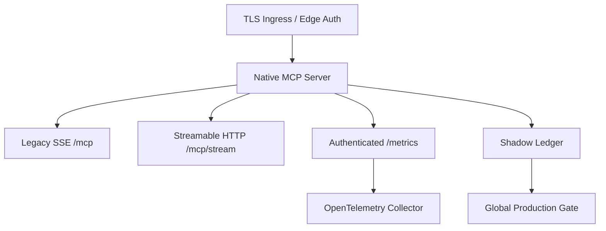

# Sovereign Global Production Readiness - 2026-06-02

Generated: 2026-06-19T13:35:53.449Z

## Strict Global Production Score: 84/100

Result: global production gate is not fully passed yet.

## Score Matrix

| Lane | Points | Evidence |
| --- | ---: | --- |
| MCP authenticated runtime + tool calls | 20/20 | native MCP score 100/100; Streamable HTTP true |
| Security/secrets/authorization boundaries | 7/15 | secret findings 3; security-audit write denial true |
| CloudOps/TLS/container/Kubernetes readiness | 15/15 | k8s files 8; TLS true; probes true; resources true |
| Observability/SLO/metrics/traces/logs | 15/15 | Prometheus true; OTel true; SLO true |
| CI/CD/supply-chain/release gates | 2/10 | workflows 3; audit false; production gate false |
| Runtime swarm execution proof | 10/10 | dry-run true; live ledger true |
| Live UI DOM/accessibility/screenshot proof | 10/10 | DOM true; screenshot true; accessibility true |
| Docs/AGENTS/skills drift control | 5/5 | docs audit true |

## Remaining Gates

- Remove or redact remaining hardcoded secret patterns from tracked production files.

## Secret Findings

- .al-masdar\worktrees\grp-sandbox-001\package\cli.js: env-assignment
- .al-masdar\worktrees\grp-sandbox-001\security_audit_report.md: private-key
- .al-masdar\worktrees\grp-sandbox-001\vscode-extension\package\cli.js: env-assignment

## Mermaid

