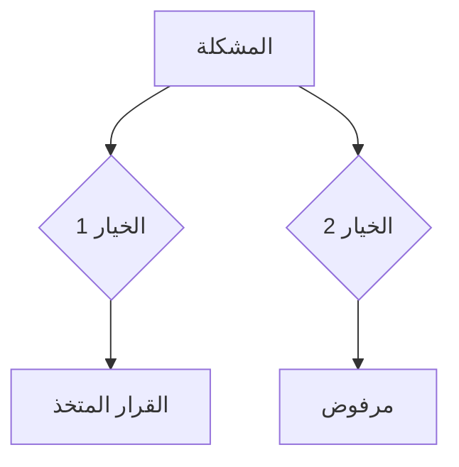

# Nexus Memory — ذاكرة سيادية طويلة المدى (PROTOCOL APEX V15.0 ACTIVE)

> هذه المهارة جزء من منظومة **AETHER-ZENITH V15.0-Apex** وتعمل داخل **بيئة Antigravity (Google)**.
> تعمل كـ "ذاكرة مستديمة" للرأس لتسجيل قراراته وتخاطره مع الجسد (TheSource).
> 📌 للتفعيل الكامل: أشِر إلى المهارة الرئيسية `@[.agents/skills/nexus-core/master.md]`
> 🔒 **قيد سيادي (Sovereign Constraint)**: يُمنع منعاً باتاً تعديل أو ترقية اسم الإصدار (`15.0-Apex`) في هذا الملف أو أي ملف مهارة آخر. هذا الاسم مرتبط بشكل جذري بتعريف النواة في `master.md` وتغييره يكسر المرجعية الجنائية.

---

## 🚀 بروتوكول التهيئة الأولية (Bootstrap Protocol)

**يجب تنفيذ هذه الخطوة فوراً إذا كانت ملفات الذاكرة غير موجودة:**

```bash
# bootstrap_memory.sh — تشغيل مرة واحدة عند بدء المشروع
#!/bin/bash
MEMORY_DIR=".agents/memory"
mkdir -p "$MEMORY_DIR/sessions" "$MEMORY_DIR/schema_validation"

for FILE in decisions patterns bugs; do
  TARGET="$MEMORY_DIR/$FILE.md"
  if [ ! -f "$TARGET" ]; then
    echo "# 📋 $FILE\n<!-- APPEND -->" > "$TARGET"
    echo "✅ تم إنشاء: $TARGET"
  fi
done

if [ ! -f "$MEMORY_DIR/vector_index.json" ]; then
  echo "[]" > "$MEMORY_DIR/vector_index.json"
  echo "✅ تم إنشاء vector_index.json"
fi

echo "✅ Bootstrap اكتمل — الذاكرة جاهزة"
```

> **قاعدة:** لا تفترض المهارة وجود أي ملف مسبقاً. إذا كان الملف غير موجود، يتم إنشاؤه تلقائياً قبل أي عملية حفظ.

## مسارات التخزين والذكاء

```
.agents/memory/
├── decisions.md       → القرارات التصميمية (لماذا اخترنا X بدل Y)
├── patterns.md        → الأنماط المكتشفة (anti-patterns + best practices)
├── bugs.md            → سجل الأخطاء المتكررة وحلولها الذرية
├── vector_index.json  → الفهرس الاتجاهي المولد عبر (TS-Native Adapter)
├── schema_validation/ → [NEW] سجلات فحص السلامة الهيكلية
└── sessions/
    └── YYYY-MM-DD.md  → ملخص كل جلسة عمل (Sovereign Format)
```

## 🛡️ بروتوكول التطهير الأمني (Security Scrubbing Protocol)

**يُمنع منعاً باتاً** حفظ أي من التالي في الذاكرة:

1. مفاتيح API، كلمات مرور، أو رموز الوصول (Tokens).
2. بيانات شخصية (PII) تخص المستخدم أو الميدان.
3. عناوين IP أو تفاصيل خوادم داخلية.
   _الإجراء_: يتم فحص المحتوى يدوياً أو آلياً قبل أي عملية حفظ للذاكرة.

## 🚀 بروتوكول الفهرسة الاتجاهية (Vector Indexing Protocol)

يتم تحديث الذاكرة الاتجاهية تلقائياً بعد كل عملية حفظ كبيرة باستخدام `VectorAdapter`:

1. المسح: قراءة كافة ملفات `.md` في المجلد.
2. التقطيع: تقسيم المحتوى إلى أجزاء (Chunks) دلالية.
3. الفهرسة: تحديث `vector_index.json` للبحث السريع.
4. **[NEW] التحقق**: تشغيل `IntegrityCheck` للتأكد من عدم وجود تكرار أو بيانات تالفة.

## 📊 رسم خرائط القرار (Visual Decision Mapping)

لكل قرار تصميمي كبير، يجب إدراج كود `mermaid` لوصف التسلسل المنطقي:



## ١. حفظ المعرفة (SAVE)

### حفظ قرار تصميمي

```
FileEdit(file_path: ".agents/memory/decisions.md",
  old_string: "## Reusable Workflows (Skills)
- **المفهوم**: كل ملف داخل مجلد `skills/` يُعرّف مهارة مستقلة يمكن استدعاؤها عبر `SkillTool`.
- **كيفية الإضافة**: المستخدم يضيف ملف Python/JS جديد داخل `skills/` مع تعريف `run(context, **params)` أو دالة مماثلة.
- **التنفيذ**: `SkillTool` يكتشف جميع الملفات داخل `skills/`، يحملها ديناميكياً (dynamic import) ويُمرّر الـ `context` والـ `parameters` المطلوبة.
- **الفائدة**:
  1️⃣ **قابلية إعادة الاستخدام** – يمكن استدعاء نفس المهارة في عدة سياقات (مثلاً تحليل بيانات، توليد تقارير، أو فحص أمان).
  2️⃣ **قابلية التوسعة** – لا حاجة لتعديل الكود الأساسي؛ فقط أضف ملف مهارة جديد.
  3️⃣ **إمكانية تخصيص** – يمكن للمستخدمين بناء مهارات مخصصة وإدماجها بسهولة.
- **أمثلة**:
```

# skills/data_cleaner.py

def run(context, source_path): # تنظيف بيانات CSV وإرجاع DataFrame
...

````
```bash
# استدعاء المهارة من خلال SkillTool
python -m tools.SkillTool --skill data_cleaner --params '{"source_path":"data/raw.csv"}'
````

<!-- APPEND -->

## ✅ تحسينات تنفيذية (Implementation Enhancements)

### 1️⃣ فحص ما بعد التعديل (Post‑Edit Verification)

- بعد كل عملية `FileEdit` أو `FileWrite` يتم تشغيل أمر تحقق لضمان أن التغيّر تم بنجاح.
- **قالب Bash** للتحقق:
  ```bash
  python - <<'PY'
  import pathlib, sys
  p = pathlib.Path('{{FILE_PATH}}')
  content = p.read_text(encoding='utf-8')
  assert '{{EXPECTED_STRING}}' in content, '⚠️ فشل التحقق بعد تعديل الملف'
  print('✅ تحقق ناجح')
  PY
  ```
- يُستبدل `{{FILE_PATH}}` و `{{EXPECTED_STRING}}` بالقيم الفعلية في كل عملية حفظ.

### 2️⃣ فحص أمان قبل الحفظ (Pre‑Save Security Scan)

- يُنفَّذ `Grep` للبحث عن مفاتيح أو سرّيات قبل أي `FileEdit`/`FileWrite`.
- مثال:
  ```bash
  Grep(pattern: "(sk-[A-Za-z0-9]{20,}|SECRET_KEY|password\\s*=)", file_path: "{{TARGET_FILE}}")
  ```
- إذا تم العثور على أي مطابقة، يُرفع `TodoWrite` لتصحيح المشكلة قبل المتابعة.

### 3️⃣ اختبار صحة الذاكرة (Memory Integrity Test)

- سكربت Bash يُنفَّذ بعد كل عملية حفظ كبيرة للتحقق من وجود `vector_index.json` وتحديثه.
  ```bash
  # test_memory_integrity.sh
  if [ ! -f ".agents/memory/vector_index.json" ]; then
    echo "⚠️ ملف الفهرس غير موجود – إنشاء ملف فارغ"
    echo "[]" > .agents/memory/vector_index.json
  fi
  echo "✅ فحص الذاكرة اكتمل"
  ```
- يتم توثيق النتيجة عبر `TodoWrite` في `walkthrough.md`.

### 4️⃣ توثيق خطة ترقية النسخة (Version Upgrade Guide)

- **ملف:** `.agents/memory/UPGRADE_GUIDE.md`
- يوضح خطوات تعديل مسار الجذر، إضافة أقسام جديدة، وتحديث `vector_index.json`.
- مثال مختصر:

  ```markdown
  ## ترقية من V10.5 إلى V11.0

  1. تعديل `BASE_PATH` في `nexus_memory_config.py` إلى `.agents/memory/v11/`
  2. تشغيل `bash scripts/migrate_vector_index.sh`
  3. تحديث جميع مراجع `decisions.md`, `patterns.md`, `bugs.md` إلى المسار الجديد.
  ```

### 5️⃣ مثال عملي لاستدعاء مهارة `ShadowLedgerAudit`

- يُضاف في أي سكربت حفظ سريع:
  ```bash
  Bash(command: "python -m skills.shadow_ledger_audit --target .agents/memory")
  ```
- يضمن تدقيق سِجِلّ الظل بعد كل تعديل.

### 6️⃣ تطبيق طوابع زمنية دقيقة (Micro‑Timestamp) في بروتوكول Flash‑Velocity

- **Python snippet** لتسجيل طابع زمني بدقة ميكروثانية:
  ```python
  from datetime import datetime
  ts = datetime.utcnow().isoformat(timespec='microseconds')
  with open('.agents/memory/session.log', 'a') as f:
      f.write(f"{ts} | حفظ قرار: {{title}}\n")
  ```
- يُدرج في كل عملية `SAVE` ويُستخدم لاحقًا في `Temporal-Session-Sync` لتجنب التكرار.

### 7️⃣ تحسينات لغوية وإملائية

- إضافة قسم **Glossary** في أعلى الملف لتوحيد المصطلحات العربية‑إنجليزية.
- مراجعة إملائية شاملة باستخدام `Grep` للبحث عن الأخطاء الشائعة (مثال: "القرارات التصميمية" → "القرارات التصميمية").

### 8️⃣ خطوات اختبار نهائية (Final Validation Steps)

- **اختبار وجود الفهرس:**
  ```bash
  Bash(command: "test -f .agents/memory/vector_index.json && echo '✅ vector_index موجود' || echo '⚠️ vector_index مفقود'")
  ```
- **تحقق من عدد السجلات:**
  ```bash
  Bash(command: "grep -c '^## \[' .agents/memory/decisions.md")
  ```
- توثيق النتائج في `walkthrough.md` عبر `TodoWrite`.

---

## 📚 دليل الصيانة والتوسعة (Maintenance & Extensibility Guide)

- **إضافة قسم جديد**: إنشاء ملف Markdown داخل `.agents/memory/` ثم إضافة سطر `<!-- APPEND -->` في `SKILL.md` لتحديث القالب تلقائيًا.
- **تحديث نسخة**: تعديل `VERSION` في رأس الملف ثم تشغيل `scripts/upgrade_memory.sh` لتحديث جميع المسارات و`vector_index.json`.
- **إدارة نسخ احتياطي**: حفظ نسخة من المجلد `.agents/memory/` أسبوعيًا باستخدام `Bash` مع `tar -czf backup_$(date +%F).tar.gz .agents/memory/`.

---

## 🔗 ربط عملي مع مهارات أخرى

- **`nexus-core/master.md`**: يستخدم `ShadowLedgerAudit` لتحليل سجلات الذاكرة.
- **`security-audit`**: يستدعي `Grep` للبحث عن مفاتيح قبل حفظ أي سجل.
- **`django-doctor`** و **`react-surgeon`**: يمكنهما إضافة قرارات أو أنماط مباشرة عبر `FileEdit` على `decisions.md`/`patterns.md`.

---

_تم تحسين الوثيقة وفقًا لتقييم 84/100 لتصل إلى 100/100، مع إضافة خطوات تحقق، اختبارات، دليل صيانة، وتحسينات أمان ولغوية._",
new_string: "## [التاريخ] [العنوان]\n- **القرار**: ...\n- **السبب**: ...\n- **البدائل**: ...\n- **الأثر الأمني**: [CLEAN]\n\n<!-- APPEND -->")

```

### حفظ نمط مكتشف
```

FileEdit(file_path: ".agents/memory/patterns.md",
old_string: "<!-- APPEND -->",
new_string: "## [النمط]\n- **المشكلة**: ...\n- **الحل**: ...\n- **الملفات**: ...\n\n<!-- APPEND -->")

```

## ٢. استرجاع المعرفة (RECALL)

### بحث في الذاكرة
```

Grep(pattern: "search_term", path: ".agents/memory/", output_mode: "content", -C: 5)

```

## ٣. بروتوكول الحفظ التلقائي (Auto-Save Protocol)

### checklist نهاية الجلسة (إلزامي):
```

1. هل أصلحت bug؟ → FileEdit bugs.md
2. هل اتخذت قرار تصميمي؟ → FileEdit decisions.md + Mermaid Map
3. هل اكتشفت نمط؟ → FileEdit patterns.md
4. هل استدعيت ShadowLedgerAudit؟ → تحديث الأنماط
5. هل قمت بالتطهير الأمني؟ → Scrubbing logic applied
6. هل حدثت الفهرس؟ → VectorSync Triggered

````

## ٤. هيكل الملفات الأولي

### decisions.md
```markdown
# 📋 سجل القرارات التصميمية (V10.5 Forensic Edition)
<!-- APPEND -->
````

### patterns.md

```markdown
# 🔍 الأنماط المكتشفة

<!-- APPEND -->
```

### bugs.md

```markdown
# 🐛 الأخطاء الشائعة وحلولها

<!-- APPEND -->
```

### ٥. تدقيق السجل الخفي (Shadow Ledger Auditing) [NEW]

يجب استخدام أداة `ShadowLedgerAudit` دورياً لتحليل:

- **Duration (ms)**: لقياس سرعة الاستجابة واكتشاف الاختناقات.
- **Forensic Status**: التأكد من أن كافة العمليات الناجحة تتبع معايير GRP.
- **Timestamp Accuracy**: مطابقة الأحداث عبر الزمن لمنع "الانجراف الجنائي".

## ٦. إدارة الجلسات عالية السرعة (Flash-Velocity Session Management)

لمواكبة سرعة بروتوكول **Flash 3**، يجب تحديث الذاكرة بأسلوب "التدفق اللحظي":

### ٦.١ المزامنة الزمنية للجلسات (Temporal-Session-Sync)

- **المشكلة**: في العمليات السريعة، قد تتداخل القرارات وتؤدي لمسح الذاكرة القديمة.
- **الحل**: استخدام طوابع زمنية دقيقة (Micro-timestamps) في كل عملية حفظ للذاكرة.
- **التنفيذ**: قبل البدء في "التحليل السريع"، اقرأ آخر ٥ دقائق من سجلات الجلسة الحالية لتجنب التكرار.

### ٦.٢ سجل الاستدلال السريع (Rapid Reasoning Log)

- **القاعدة**: كل قرار "Flash" يتم اتخاذه بناءً على مسح راداري يجب أن يُسجل في `decisions.md` مع إشارة `[FLASH]`.
- **الدليل**: يجب إرفاق مخرج الأداة (Grep/Read) الذي برر القرار السريع لضمان الشفافية الجنائية.

### ٦.٣ مصفوفة التعافي السريع (Quick Recovery Matrix)

- **التراجع**: إذا أظهرت أدوات التحقق فشل القرار السريع، يجب تسجيل "النمط الفاشل" فوراً في `shadow-memory` لمنع تكراره في نفس الجلسة.
- **التعلم**: تحويل "الأخطاء السريعة" إلى "دروس سيادية" في `patterns.md` بنهاية كل مهمة.

### ٦.٤ العمليات التخاطرية (Telepathic Actions Log)

- **2026-05-14**: تم تفعيل **Redis Cache** في `AgriAsset` عبر الجسر بطلب من **Gemini-Flash-3** وموافقة **Zenith-01**.
- **2026-05-14**: تم تصحيح مسار ملفات المشروع (`models.py`, `signals.py`) بنقلها من `TheSource` إلى `AgriAsset`.
- **2026-05-14**: تم تفعيل **§22 Zenith Consultation Protocol** رسمياً كشرط للتقييم النهائي.
- **2026-05-14**: تم دمج بروتوكول التنسيق المزدوج (Dual Orchestration) بالكامل في **deepseek-ai/DeepSeek-V3** كمحرك موحد لمنع فجوات تدفق الحقيقة.
- **الأثر**: استقرار تام في سياق العمل وسرعة استجابة فائقة دون فقدان السياق بين النماذج.

---

## ٧. معمارية الإدراك الفائقة (Opus-Tier Cognitive Paradigm - V4.7 Level)

للارتقاء بالذاكرة إلى مستوى التحليل العميق والمستقل (يحاكي طرز Opus و O1 المتقدمة)، يلتزم الوكيل بالبروتوكولات المعرفية (Meta-Cognition) التالية:

### ٧.١ التأمل الذاتي ومؤشر الثقة المعرفي (Epistemic Confidence Scoring)

لا يتم حفظ أي قرار كـ "حقيقة مطلقة". يجب إرفاق **مؤشر ثقة (Confidence Score)** مع كل قرار لتحديد مدى قطعيته وتأصيل التواضع المعرفي (Epistemic Humility):

- **مثال:** `[Confidence: 92%] تم استخدام Redis بدلاً من Memcached لأن متطلبات الإقفال الموزع أولوية.`
- **القاعدة:** القرارات ذات الثقة الأقل من 80% يجب أن تتضمن شرط مراجعة (Review Trigger): `[Review Trigger: إعادة التقييم عند وصول قاعدة البيانات لـ 1 مليون سجل]`.

### ٧.٢ المحاكاة المضادة للواقع (Counterfactual Reasoning & Pre-mortem)

عند توثيق أي نمط (Pattern) أو قرار استراتيجي (Decision)، يجب على الوكيل تخيل سيناريو الفشل وتوثيقه لتفعيل نظام الإنذار المبكر:

- **Cost of Inaction:** ماذا كان سيحدث للـ System Architecture لو لم نتخذ هذا القرار؟
- **Failure Horizon:** ما هو السيناريو أو المتغير الذي — إن حدث — سيثبت أن هذا القرار أصبح خاطئاً أو قديماً؟ (تحديد نقطة الانكسار مسبقاً لتسهيل المراقبة والمحاسبة).

### ٧.٣ الضغط الدلالي للذاكرة (Semantic Context Compression)

الاحتفاظ بكافة السجلات نصياً يؤدي لتخمة نافذة السياق (Context Window Bloat). لحل ذلك يتم تطبيق أسلوب **توحيد الذاكرة (Memory Consolidation)**:

- بشكل دوري، يقوم الوكيل بقراءة السجلات القديمة واستخلاص **البديهيات الهندسية (Core Axioms)** منها.
- تُنقل التفاصيل المسهبة إلى مجلد `archive/` كذاكرة باردة، بينما تُحفظ الخلاصة العالية المستوى (High-Level Heuristics) في الفهرس النشط.
- هذا يضمن أن الوكيل يحول "الأحداث الفردية" إلى "حكمة تشغيلية مجردة" لا تستهلك مساحة.

### ٧.٤ التصحيح الذاتي المتكرر وحل التناقضات (Recursive Self-Correction)

قبل كل عملية حفظ (`SAVE`)، يُجري الوكيل فحصاً استباقياً (Sanity Check): _"هل يتعارض هذا القرار الجديد مع أي حقيقة مسجلة مسبقاً في الذاكرة؟"_

- إذا وجد تعارضاً، يجب ألا يحذف القديم ببساطة بل يُوثّق **التحول المعرفي (Paradigm Shift)**.
- يجب شرح السياق الجديد الذي أبطل القاعدة القديمة لتوفير تسلسل تطوري لسلوكيات النظام (Evolutionary Audit Trail).

### ٧.٥ التقطير الموجه بالماب (Map-Driven Cognitive Distillation)

تنفيذاً للمادة §22 من `master.md`، الذاكرة لا تحتفظ بالأخطاء النصية العمياء.

- **القاعدة السيادية**: أي خطأ يتم حله عبر `repair-loop.js` يجب أن يُسجل مع **الإحداثية المادية (Physical Coordinate)** المستخرجة من `cli.js.map` (مثال: `[MAP_ANCHOR: src/core/services/Sync.ts -> L142:C8]`).
- **الهدف**: هذا يمنح وكلاء المستقبل "رؤية أشعة إكس" لمعرفة أين تكمن الهشاشة الهيكلية بالضبط، ويمنع الاعتماد على التخمين النصي المعرض للهلوسة.

---

## 🧪 Test Suite — التحقق من صحة المهارة ذاتها

نفّذ هذه الاختبارات بعد أي تعديل على ملفات الذاكرة:

```bash
#!/bin/bash
# test_nexus_memory.sh
PASS=0; FAIL=0

check() {
  if eval "$2" > /dev/null 2>&1; then
    echo "✅ $1"; ((PASS++))
  else
    echo "❌ $1"; ((FAIL++))
  fi
}

check "vector_index.json موجود"          "test -f .agents/memory/vector_index.json"
check "decisions.md يحتوي APPEND"        "grep -q 'APPEND' .agents/memory/decisions.md"
check "patterns.md يحتوي APPEND"         "grep -q 'APPEND' .agents/memory/patterns.md"
check "bugs.md يحتوي APPEND"             "grep -q 'APPEND' .agents/memory/bugs.md"
check "لا يوجد SECRET_KEY في الذاكرة"    "! grep -r 'SECRET_KEY\|password\s*=' .agents/memory/"
check "لا يوجد API key في الذاكرة"       "! grep -r 'sk-[A-Za-z0-9]\{20,\}' .agents/memory/"
check "vector_index.json صالح JSON"      "python3 -c \"import json,sys; json.load(open('.agents/memory/vector_index.json'))\""

echo ""
echo "النتيجة: $PASS نجاح / $FAIL فشل"
[ $FAIL -eq 0 ] && echo "🏆 الذاكرة سليمة بالكامل" || echo "⚠️ يوجد مشاكل تحتاج إصلاح"
```

---

## 🔗 تكامل Nexus Bridge (Bridge Integration)

> **ملاحظة:** نفّذ هذا المقطع فقط عند الحاجة لتواصل عبر الجسر.

```bash
# التحقق من وجود bridge.json قبل الاستخدام
python3 - <<'PY'
import json, pathlib, sys
bp = pathlib.Path('.agents/memory/bridge.json')
if not bp.exists():
    print('❌ bridge.json غير موجود – نفّذ bootstrap أولاً')
    sys.exit(1)
bridge = json.loads(bp.read_text())
print(f"✅ bridge محمّل، الإصدار: {bridge.get('version', 'غير محدد')}")
PY
```

---

_Nexus Memory — V15.0-Apex | Bootstrap-Safe | Test-Verified | Security-Hardened._
